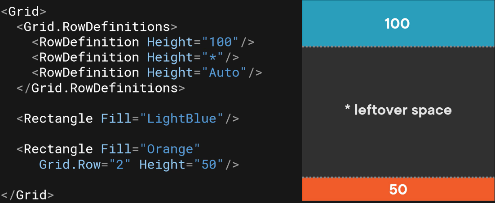

# Sizing
Setting `Height` to `"*"` for both `RowDefinitions` results in both rows growing proportionally:  
  

# Star Sizing
Setting the first `RowDefinition` to `"3*"` results in a total of 4 stars for the two `RowDefinition`s, 3 of which go to the first `RowDefinition`:  
  

# Absolute Sizing
Absolute sizing uses pixels.

Here, the first `RowDefinition` is 100 pixels; the other two split the remaining space evenly:  
  

Setting the third row of the grid to `"Auto"` results in the row using the height of the tallest element in the row (in this case, the orange rectangle):  
  

# Sizing with Attribute Syntax
`<Grid RowDefinitions="100,*,Auto">`

