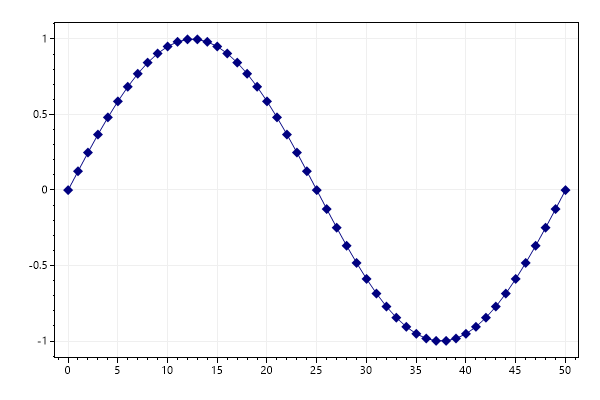
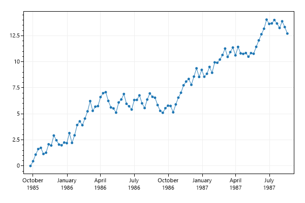
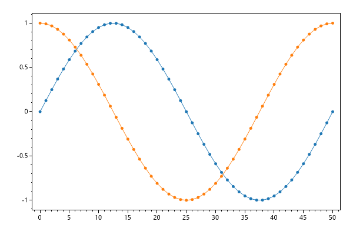
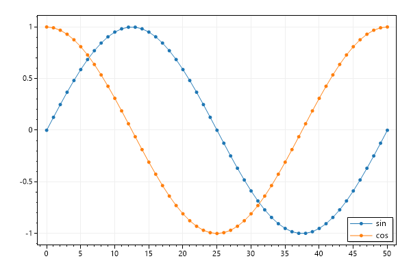

# scottplot
ScottPlot is a plotting library for .NET.
- Documentation: https://scottplot.net/cookbook/4.1/category/quickstart/#scatter-plot

# versions
There are two major versions of ScottPlot:
- 4.1 — stable
- 5.0 — beta

# creating plots
A `ScottPlot.Plot` can hold one or more *Plottables*:
```cs
using ScottPlot;

// width = 350
var plot = new Plot(350, 350);
```

# scatter plots
Documentation: https://scottplot.net/cookbook/4.1/#scatter-plot

## simple
```cs
// sample data
double[] xs = DataGen.Consecutive(51);
double[] sin = DataGen.Sin(51);
double[] cos = DataGen.Cos(51);

// add two scatter plots:
plot.AddScatter(xs, sin);
plot.AddScatter(xs, cos);
```

## advanced
Manually create a scatter plot `Plottable`:
```cs
// data
double[] xs = DataGen.Consecutive(51);
double[] sin = DataGen.Sin(51);

var scatterPlot = new ScottPlot.Plottable.ScatterPlot(xs, sin);

// customize the scatter plot:
scatterPlot.Color = Color.Navy;
scatterPlot.MarkerSize = 10;
scatterPlot.MarkerShape = MarkerShape.filledDiamond;

plot.Add(scatterPlot);
```


## plotting datatime data
1. Use `DateTime.ToOADate()` to convert a `DateTime[]` to a `double[]`:
    ```cs
    DateTime[] myDates = new DateTime[100];

    double[] xs = myDates.Select(x => x.ToOADate()).ToArray();
    double[] ys = DataGen.RandomWalk(myDates.Length);
    ```
2. Plot the data:
    ```cs
    plot.AddScatter(xs, ys)
    ```
3. Configure the tick labels for a time format:
    ```cs
    plot.XAxis.DateTimeFormat(true)
    ```


# customizing 
## axis customization
Documentation: https://scottplot.net/cookbook/4.1/category/axis-and-ticks/#axis-customizations

### axis labels
```cs
plot.Title("Some Title");

plot.XAxis.Label("Horizontal below the plot");

plot.XAxis.Label2("Horizontal on top of the plot");

plot.YAxis.Label("Vertical Axis");
```

### Axis Colors, Size & Fonts
```cs
// set the color of the axis labels, lines, ticks, and tick labels:
plot.XAxis.Color(Color.Green);

// customize an axis color, size, and font:
plot.YAxis.Label("Vertical Axis", Color.Magenta, size: 24, fontName: "Comic Sans MS");
```

### axis limits
```cs
// -X, +X, -Y, +Y:
plot.SetAxisLimits(-20, 80, -2, 2);
```

Or:
```cs
plot.XAxis.SetBoundary(-20, 80);
plot.YAxis.SetBoundary(-2,2)
```

## grid customization
Remove the grid:
```cs
plot.Grid(false)
```


Remove just the vertical (X axis) grid:
```cs
plot.XAxis.Grid(false)
```


## legends
Documentation: https://scottplot.net/cookbook/4.1/#legend  

For plottables that support them, add a legend:
```cs
plot.Legend();
```


# managing plottables
Add a plottable:
```cs
plot.Add(somePlot);
```

Remove a plottable:
```cs
plot.Remove(somePlot);
```

Clear all plottables:
```cs
plot.Clear();
```

# saving plots
```cs
plot.SaveFig("SomePlot.png");
```