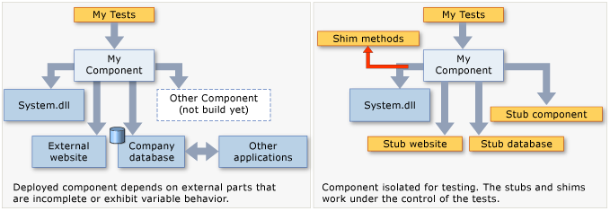
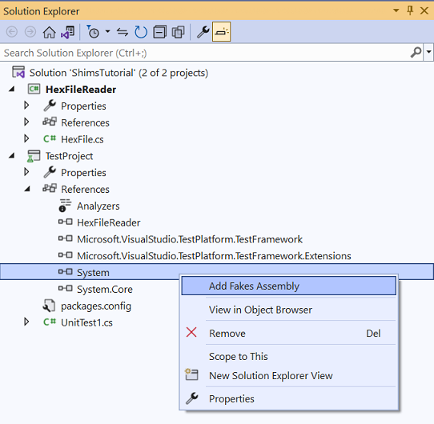

# Overview
> Documentation: https://learn.microsoft.com/en-us/visualstudio/test/isolating-code-under-test-with-microsoft-fakes?view=vs-2022  
<g>Availability</g>: Visual Studio Enterprise Edition, Visual Studio 2019 Update 6+

Code isolation is a testing strategy that isolates code under test from the rest of the application. This allows for
testing the specific functionality of the code in isolation. If a test fails, the cause is in the isolated code, not
somewhere else. It also enables testing code even if other parts of the application are not yet functional.

# How it Works
Microsoft Fakes achieves code isolation using *stubs* and *shims*:
- **Stubs** — used to replace a class with a small substitute that implements the same interface.
  - Requires application design such that each component depends only on interfaces, not other components.
  - Typically, used for calls within a solution.
  - Some external assemblies do not provide interface definitions, so shims needs to be used instead.
  - Pros: 
    - Stubs can be generated from interface definitions in Visual Studio.
  - Cons:
    - Stubs cannot be used for static methods or sealed types (since  they cannot have an interface).
    - Can only replace visible (non-private) methods.
- **Shims** — used to modify the compiled code at runtime. Instead of making a specified call, the application runs the provided shim code. Shims replace calls to assemblies that are not in your control.
  - Typically, used for calls to other referenced assemblies.
  - Pros:
    - Can replace calls to private methods if all the types on the method signature are visible.
  - Cons:
    - Shims run slower than stubs because they rewrite code at runtime.

# Creating a Microsoft Fakes Assembly
 1. Solution Explorer > **TEST_PROJECT_NAME** > [**Assemblies**, **Projects** or **Packages**] 
 2. Right-click the assembly that contains class definitions to be stubbed > **Add Fakes Assembly**
 