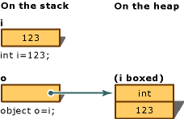

# Overview
Boxing & Unboxing are performed by the CLR because it uses the Unified Type System in which a value of any type is treated an object.

# Boxing
- Converting a value type (`struct`, `enum`, numeric types, `floats`, `bool`, `char`) to `object` (or an interface type implemented by this value).
- The CLR "boxes" the value inside an `object` and stores it on the heap.
- A new `object` is allocated, constructed, and stored.  This is expensive.
- The operation is implicit.

# Unboxing
- Extracting the value type from the object.
- The operation is explicit.

# Example
  
Boxing occurs implicitly:
```cs
int i = 123;
object o = i; // i is now boxed in o.
```

Note that `o` is not a reference to `i`:
```cs
i = 456; // This does not change o.
```

Unboxing
```cs
o = 123;
i = (int)o;
```

# Performance
Boxing stores the value type on the garbage-collected heap.  Because a new object must be allocated and constructed, this is computationally expensive.  The cast required to unbox is also expensive, but less so.

Any time a type can store both value and reference types (like `ArrayList`), it will box/unbox the value types into objects.
