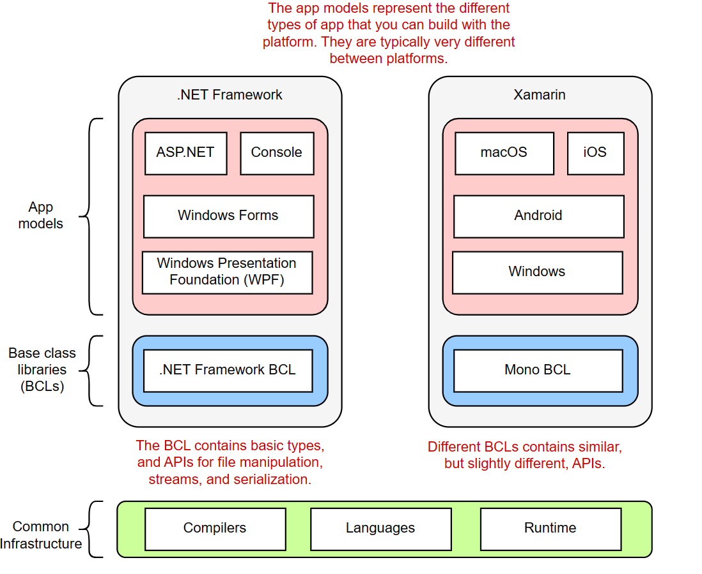
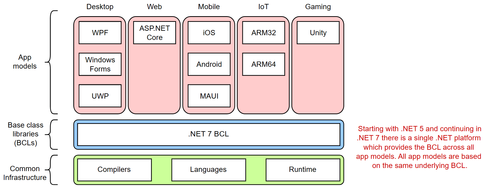

# .NET is...    
  
  

https://github.com/_net/standard/blob/release/3.0/docs/metaphor.md

# C# is...
- Strongly-typed:
    - Every variable and constant has a type.
    - Every expression that evaluates to a value has a type.
    - Every method declaration specifies a name, and a type and kind for each parameter and for the return value.
- Object-oriented (programmer defines types and their behavior)
    - Encapsulation
    - Inheritance
    - Polymorphism
- Component-oriented 
- Type-safe
- Garbage-collected (automatically reclaims memory from unreachable, unused objects)

## C# has support for...
- Nullable types (guard against variables that don't refer to allocated objects)
- Asynchronous operations
- Unified type system:
    - All types inherit from a single root object type.
    - A value of any type can be treated as an object.
- User-defined reference types
- User-defined value types
- Generics
- Iterators

## C# runs on .NET
- .NET – ecosystem; standard way of building applications; tools and libraries.
    - FCL (Framework Class Library) – Create programs in a variety of languages (C#, F#, VB, …).
        - Includes libraries.
    - A virtual execution system called the CoreCLR (Common Language Runtime).
        - CLR is Microsoft's implementation of CLI (Common Language Infrastructure), an international standard.
- .NET Ecosystem = Languages + Compilers + Runtime.

# .NET
## .NET Standard
A formal specification of .NET APIs available on multiple .NET implementations.
- .NET 5+ eliminate the need for .NET Standard.
- No new versions of .NET Standard will be released.
 | 
## .NET Framework
The original .NET implementation.
- Includes:
    - CLR for managing execution of code.
    - BCL (Base Class Library) to provide a rich class library to build applications.
- Installed on over 1B machines.  
- Must change as little as possible.

## Mono
A 3rd-party cross-platform implementation of .NET Framework.
- Fell well behind the upstream.

## Xamarin
A 3rd-party mobile development platform.
- Purchase by Microsoft in 2016.

## Unity
A game development platform.

## .NET Core 
A cross-platform development platform.
- Includes:
    - CoreCLR – A cross-platform CLR.
    - CoreFx – A streamlined BCL.

## Modern .NET (.NET 5+)
The evolution of .NET Core.  .NET Core has been renamed .NET going forward.
- Cross-platform.
- Implements .NET Standard (code that targets .NET Standard can run on .NET 5+).
- Eliminates the need for .NET Standard going forward.

C# compiles to an Intermediate Language (IL) (also part of the CLI spec)
- IL code and resources (bitmaps, strings) are stored in an assembly as a .DLL.
- An assembly contains a manifest that provides information about its types, version, and culture.
- IL code produced by C# can interact with other CLR 

When a C# program is executed
1. The assembly is loaded into CLR.
2. The CLR performs JIT compilation to compile the IL code into native code.
3. The CLR provides services for garbage collection, exception handling, resource management.
4. Code that's executed by the CLR is managed code.

# Application Models
| Model | Framework | Notes |
|-------|-----------|-------|
| Web | ASP.NET Core | Server-side logic. |
| Web | ASP.NET Core MVC | Server-side logic for web pages or web APIs. |
| Web | ASP.NET Core Razor | Server-generated HTML. |
| Web Client | Blazor | Blazor's 2 modes: (1) DOM manipulation via sockets, or WebAssembly |
| Desktop | WinForms | "Classic" Windows applications. |
| Desktop | WPF | Windows Presentation Foundation.  "Modern." |
| Mobile | Xamarin | iOS and Android apps. |
