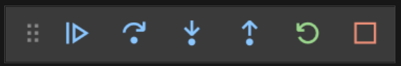

# Breakpoint
Stop execution when this is reached to allow you to inspect the state.

## Add/remove a breakpoint
Click to left of line number (red dot).

# Conditional breakpoint
Stop execution only if condition is true.

## Add/remove a conditional breakpoint
Right-click to the left of the line number.

# Watch panel
Track a variable state across time or functions.
- Click **+** button to add a variable to watch, or;
- Right-click variable in Variables panel and select **Add to watch**.
	
# Call Stack panel
  
Shows stack trace but only those from the code (not the runtime).

## Control Execution
- **Continue**/**pause**
- **Step over** – execute the next code statement.
- **Step into** – like Step over, but if next statement is a function call, move to the first code statement of this function.
- **Step out** – if in a function, execute the remaining code in the function then move to the statement after the function call.
- **Restart**
- **Stop**

Debug Console – <kbd>Ctrl+Shift+Y</kdb>
- You can enter expressions into the console which will be evaluated against the current state.

# Logging and Tracing
## `System.Diagnostics.Trace` 
- Enabled for both `--configuration debug` and `release`.  
- Writes to attached Listeners (by default, `DefaultTraceListener`).
- Use this when creating logs that will be enabled in most builds.

## `System.Diagnostics.Debug`
- Only enabled for `--configuration debug`.
- Writes to an attached debugger.
- Calls to `Debug.WriteLine` will not trigger on `--configuration release`.

## Trace Listeners
The `DefaultTraceListener` writes to the DEBUG console.

### Configuring
```cs
Trace.Listeners.Add(new TextWriterTraceListener(File.CreateText(path)));
```

Text writers use buffers to improve performance.  Optionally enable AutoFlush to ensure traces are written right away instead of buffered:
```cs
Trace.AutoFlush = true;
```

### Configuring in `appsettings.json`
```json
{
  "MySwitch": {
    "Level": "Info"
  }
}
```

## Trace Levels
0 – Off  
1 – Error  
2 – Warning  
3 – Info  
4 – Verbose  

*Edge case* — An extreme of a parameter.

# Defensive programming
- A way of programming where the application behaves in a consistent, predictable manner, regardless of input.
- All edge cases are tested and functions have clear requirements.
- Input is validated.

# Methods
```cs
Assert(condition, "message");
Write
WriteLine
WriteIf(condition, "message");
WriteLineIf(condition, "message");
```
