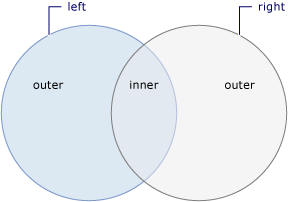

# [Overview](https://learn.microsoft.com/en-us/dotnet/csharp/linq/standard-query-operators/join-operations)
A join operation is the association of objects in one data source with objects that share a common attribute in another data source.

Join operations target data sources whose relationships to each other cannot be followed directly.

# Join Type
In LINQ, `Join` implements an *inner join*.  
`GroupJoin` has no direct equivalent in relational database terms.  
It implements a superset of *inner joins* and *outer joins.*  

# Methods
| Method      | Description                                                                                           | Query expression                 |
| ----------- | ----------------------------------------------------------------------------------------------------- | -------------------------------- |
| `Join`      | Join two sequences based on key-selector functions and extract pairs of values.                       | join … in … on … equals …        |
| `GroupJoin` | Join two sequences based on key-selector functions and group the resulting matches from each element. | join … in … on … equals … into … |



# `Join` example
Join two sequences based on a specific value:
```cs
var query = from student in students
            join department in departments on student.DepartmentID equals department.ID
            select new { Name = $"{student.FirstName} {student.LastName}", DepartmentName = department.Name };
```

In method syntax:
```cs
var query = students.Join(departments,
    student => student.DepartmentID, department => department.ID,
    (student, department) => new { Name = $"{student.FirstName} {student.LastName}", DepartmentName = department.Name });
```

# `GroupJoin` example
Join two sequences based on a specific value and group the resulting matches for each element:
```cs
IEnumerable<IEnumerable<Student>> studentGroups = 
            from department in departments
            join student in students on department.ID equals student.DepartmentID into studentGroup
            select studentGroup;
```

In method syntax:
```cs
IEnumerable<IEnumerable<Student>> studentGroups = 
    departments.GroupJoin(students,department => 
        department.ID, student => 
            student.DepartmentID, (department, studentGroup) => studentGroup);
```

# Inner joins
Assuming collections A and B, an *inner join* results in a set in which each element in A appears one time for every matching element in B.  
If an element in A has no match in B, it does not appear in the result. Inner joins are implemented via the `Join` method. There are four
types of such joins:
1. Single key join
2. Composite key join
3. Multiple join
4. Inner join using grouped join

## Single key join
Compare elements based on a single property. Match `Teacher` objects with `Department` objects whose `TeacherId` matches that `Teacher`:
```cs
var query = from department in departments
            join teacher in teachers on department.TeacherID equals teacher.ID
            select new
            {
                DepartmentName = department.Name,
                TeacherName = $"{teacher.First} {teacher.Last}"
            };
```

In method syntax:
```cs
var query = teachers.Join(departments, teacher => 
    teacher.ID, department => 
        department.TeacherID, (teacher, department) =>
            new { DepartmentName = department.Name, TeacherName = $"{teacher.First} {teacher.Last}" });
```

## Composite key join
See https://learn.microsoft.com/en-us/dotnet/csharp/linq/standard-query-operators/join-operations#composite-key-join.

## Multiple join
See https://learn.microsoft.com/en-us/dotnet/csharp/linq/standard-query-operators/join-operations#multiple-join.

## Inner join using a group join
See https://learn.microsoft.com/en-us/dotnet/csharp/linq/standard-query-operators/join-operations#inner-join-by-using-grouped-join.

# Group joins
See https://learn.microsoft.com/en-us/dotnet/csharp/linq/standard-query-operators/join-operations#perform-grouped-joins.

# Left outer joins
See https://learn.microsoft.com/en-us/dotnet/csharp/linq/standard-query-operators/join-operations#perform-left-outer-joins.