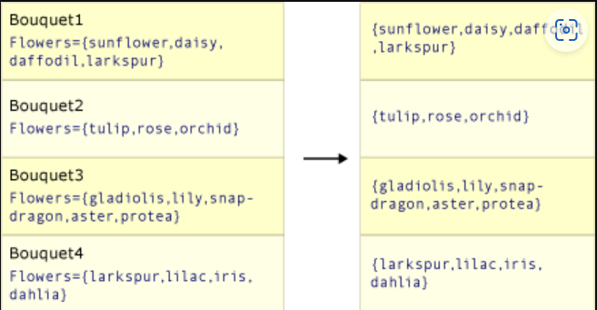
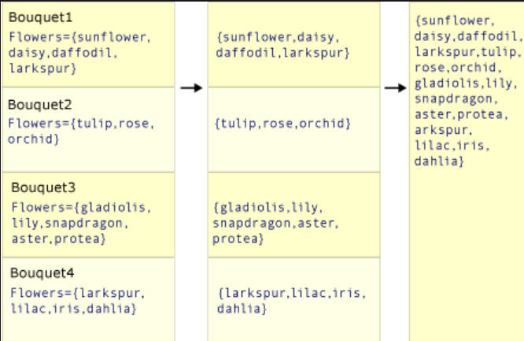

# [Overview](https://learn.microsoft.com/en-us/dotnet/csharp/linq/standard-query-operators/projection-operations)
A projection operation transforms an object into a new form that often consists only of those properties that will be 
subsequently used.

# methods
| Method       | Description                                                                                                | Query expression        |
| ------------ | ---------------------------------------------------------------------------------------------------------- | ----------------------- |
| `Select`     | Project values that are based on a transform function                                                      | `select`                |
| `SelectMany` | Project sequences of values that are based on a transform function and then flatten them into one sequence | Multiple `from` clauses |
| `Zip`        | Produce a sequence of tuples with elements from 2-3 sequences                                              | N/A                     |

# `Select` vs `SelectMany`
## `Select`
`Select` produces one output value for every input value, like so:  


To project the first letter in each string in a list of strings:
```cs
List<string> words = ["an", "apple", "a", "day"];
```

In query syntax:
```cs
var query = from word in words
            select word.Substring(0, 1);
```

In method syntax:
```cs
IEnumerable<string> result = words.Select(selector => selector.ToUpper());
```

## `SelectMany`
`SelectMany` produces a single output that contains the concatenated sub-collections from each input value. 
The transform function that is passed must return an enumerable sequence of values for each source value. 
These enumerable sequences are then concatenated to create one large sequence, like so:


To project each word from each string in a list of strings:
```cs
List<string> phrases = ["an apple a day", "the quick brown fox"];
```

In query syntax:
```cs
var query = from phrase in phrases
            from word in phrase.Split(' ')
            select word;
```

In method syntax:
```cs
var query = phrases.SelectMany(phrases => phrases.Split(' '));
```

# `Zip`
Zip methods work on sequences of two or more possibly heterogeneous types.

Assume these collections:
```cs
// An int array with 7 elements.
IEnumerable<int> numbers = [1, 2, 3, 4, 5, 6, 7];
// A char array with 6 elements.
IEnumerable<char> letters = ['A', 'B', 'C', 'D', 'E', 'F'];
// A string array with 8 elements.
IEnumerable<string> emoji = [ "🤓", "🔥", "🎉", "👀", "⭐", "💜", "✔", "💯"];
```

## Overload 1 — Using `Zip` to return tuples
The first `Zip` overload returns tuples. To project the first two sequences together:
```cs
foreach ((int number, char letter) in numbers.Zip(letters))
    Console.WriteLine($"Number: {number} zipped with letter: '{letter}'");
```

Output:
```
Number: 1 zipped with letter: 'A'
Number: 2 zipped with letter: 'B'
Number: 3 zipped with letter: 'C'
Number: 4 zipped with letter: 'D'
Number: 5 zipped with letter: 'E'
Number: 6 zipped with letter: 'F'
```

> [!IMPORTANT]
> The output sequence of a zip operation is never longer in length than the shortest input sequence.  
> Each element needs a corresponding element in the other sequence to "zip" with.

## Overload 2 — Adding a third sequence
The second `Zip` overload also returns a tuple. To project all three sequences together:
```cs
foreach ((int number, char letter, string em) in numbers.Zip(letters, emoji))
    Console.WriteLine($"Number: {number} is zipped with letter: '{letter}' and emoji: {em}");
```

Output:
```
Number: 1 is zipped with letter: 'A' and emoji: 🤓
Number: 2 is zipped with letter: 'B' and emoji: 🔥
Number: 3 is zipped with letter: 'C' and emoji: 🎉
Number: 4 is zipped with letter: 'D' and emoji: 👀
Number: 5 is zipped with letter: 'E' and emoji: ⭐
Number: 6 is zipped with letter: 'F' and emoji: 💜
```

## Overload 3 — Using a 'results selector'
The third `Zip` overload accepts a `Func<T1, T2, T3>` argument that acts as a "results selector." To project a new
resulting sequence from the sequences being zipped:

```cs
foreach (string result in numbers.Zip(letters, (number, letter) => $"{number} = {letter} ({(int)letter})"))
    Console.WriteLine(result);
```

Output:
```
1 = A (65)
2 = B (66)
3 = C (67)
4 = D (68)
5 = E (69)
6 = F (70)
```