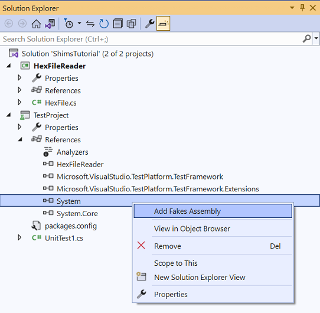

# Overview [[Documentation](https://learn.microsoft.com/en-us/visualstudio/test/using-shims-to-isolate-your-application-from-other-assemblies-for-unit-testing?view=vs-2022&tabs=csharp)]  

A *shim* is code that intercepts a call to a method and diverts it to shim code within a test. Use shims when
you need to isolate your code from external assemblies.

<o>Caution</o>: Tests involving shim types **cannot** run concurrently. <r>This is not enforced by the Fakes runtime</r>.

## Example: Creating and Using Shims
1. Create a class:
    ```cs
    // HexFile.cs
    public class HexFile
    {
        public string[] Records { get; private set; }

        public HexFile(string path)
        {
            this.Records = System.IO.File.ReadAllLines(path);
        }
    }
    ```
2. Create a test project.
3. From the test project, add a project reference to HexFile.
4. Add a Fakes Assembly:
   1. Solution Explorer > **TestProject** > [**Assemblies**, **Projects** or **Packages**] 
   2. Right-click the `System` assembly > **Add Fakes Assembly**  
      
5. Modify `Fakes/mscorlib.fakes` to exclude types that cannot be used with shims:
    ```xml
    <Fakes xmlns="http://schemas.microsoft.com/fakes/2011/" Diagnostic="true">
        <Assembly Name="mscorlib" Version="4.0.0.0"/>
        <StubGeneration>
            <Clear/>
        </StubGeneration>
        <ShimGeneration>
            <Clear/>
            <Add FullName="System.IO.File"/>
            <Remove FullName="System.IO.FileStreamAsyncResult"/>
            <Remove FullName="System.IO.FileSystemEnumerableFactory"/>
            <Remove FullName="System.IO.FileInfoResultHandler"/>
            <Remove FullName="System.IO.FileSystemInfoResultHandler"/>
            <Remove FullName="System.IO.FileStream+FileStreamReadWriteTask"/>
            <Remove FullName="System.IO.FileSystemEnumerableIterator"/>
        </ShimGeneration>
    </Fakes>
    ```
6. Create a Unit Test
7. Modify the default `UnitTest1.cs` file with this test method:
    ```cs {hl_lines=4}
    [TestMethod]
    public void TestFileReadAllLine()
    {
        // Important: each ShimContext must be disposed, so wrap in using():
        using (ShimsContext.Create())
        {
            // Arrange
            System.IO.Fakes.ShimFile.ReadAllLinesString = (s) => new string[] { "Hello", "World", "Shims" };

            // Act
            var target = new HexFile("this_file_doesnt_exist.txt");

            Assert.AreEqual(3, target.Records.Length);
        }
    }
    ```
8. Run the test.

# Shim Behavior
Each generated shim type receives an `IShimBehavior` through the `ShimBase<T>.InstanceBehavior` property. Whenever a client calls a member
*that has not been shimmed*, this behavior is invoked. If no behavior has been set, it uses `ShimBehaviors.Current` which throws
a `NotImplementedException` by default.

This example changes the behavior so that the shim either does nothing or returns the default value of the return type:
```cs
// unit test code
var shim = new ShimMyClass();
shim.InstanceBehavior = ShimBehaviors.DefaultValue; //return default(T) or do nothing
```

To change the behavior globally for all shims where behavior has not been set, use `ShimBehaviors.Current`:
```cs
// unit test code
ShimBehaviors.Current = ShimBehaviors.DefaultValue;
```

## Identifying Interaction with External Dependencies
By setting `Behavior` property of a shim type to `ShimBehaviors.NotImplemented`, any access to a member of that type throws a `NotImplementedException`. This
can serve as a signal during testing to indicate code is attempting to access an external component:
```cs
// unit test code
ShimMyClass.Behavior = ShimBehaviors.NotImplemented;
// or, use this shorthand:
ShimMyClass.BehaveAsNotImplemented();
```

## Invoke the Original Method form Within a Shim Method
In this example, the use case might be writing text to the file system after validating the file name passed to a the method. To achieve this, there are
two approaches:
1. Encapsulate a call to the original method using a delegate and `ShimsContext.ExecuteWithoutShims()`:
    ```cs
    // unit test code
    ShimFile.WriteAllTextStringString = (fileName, content) => 
    {
        ShimsContext.ExecuteWithoutShims(() => 
        {

            Console.WriteLine("enter");
            File.WriteAllText(fileName, content);
            Console.WriteLine("leave");
        });
    };
    ```
2. Nullify the shim, call the original method, then restore the shim:
    ```cs
    // unit test code
    ShimsDelegates.Action<string, string> shim = null;
    shim = (fileName, content) => 
    {
        try 
        {
            Console.WriteLine("enter");
            ShimFile.WriteAllTextStringString = null; // remove shim in order to call original method
            File.WriteAllText(fileName, content);
        }
        finally
        {
            ShimFile.WriteAllTextStringString = shim; // restore shim
            Console.WriteLine("leave");
        }
    };
    // initialize the shim
    ShimFile.WriteAllTextStringString = shim;
    ```

## Shimming System.Environment
See [here](https://learn.microsoft.com/en-us/visualstudio/test/using-shims-to-isolate-your-application-from-other-assemblies-for-unit-testing?view=vs-2022&tabs=csharp#shimming-systemenvironment).

# Shimming Different Types of Methods
## Shims for Static Methods
For static methods, a shim type has properties that hold shims. The properties only have a setter. This setter is used to attach a delegate to the targeted method:
```cs
//code under test
public static class MyClass 
{
    public static int MyMethod() { ... }
}
```

Attach a shim to `MyMethod` that always returns 5:
```cs
// unit test code
ShimMyClass.MyMethod = () => 5;
```

## Shims for Instance Methods (All Instances)
For instance methods, properties that hold shims are placed in a nested type named `AllInstances` (because the shim is for all instances of the method):
```cs
// code under test
public class MyClass 
{
    public int MyMethod() { ... }
}
```

Attach a shim to `MyMethod` that always returns 5 (regardless of the instance):
```cs
// unit test code
ShimMyClass.AllInstances.MyMethod = () => 5;
```

## Shims for Instance Methods (Single Instance)
For instance methods where only a single instance is shimmed, properties that hold these shims are instance methods of the shim type itself:
```cs
// code under test
public class MyClass 
{
    public int MyMethod() { ... }
}
```

Create two shim types for `MyMethod`, one that always returns 5 and one that always returns 10:
```cs
// unit test code
var myClass1 = new ShimMyClass()
{
    MyMethod = () => 5
};
var myClass2 = new ShimMyClass { 
    MyMethod = () => 10 
};
```

Access the shimmed type instance either through the `Instance` property...
```cs
// unit test code
var shim = new ShimMyClass();
var instance = shim.Instance;
```

...or directly via an implicit conversion:
```cs
// unit test code
var shim = new ShimMyClass();
MyClass instance = shim; // implicit cast retrieves the runtime instance
```

## Shims for Constructors
Every constructor is represented as a static method named `Constructor` within the shim type:
```cs
public class MyClass 
{
    public MyClass(int value) 
    {
        this.Value = value;
    }
    ...
}
```

Create a shim type for the constructor that will always return -5:
```cs
// unit test code
ShimMyClass.ConstructorInt32 = (@this, value) => 
{
    var shim = new ShimMyClass(@this) 
    {
        ValueGet = () => -5
    };
};
```

Each shim type exposes two constructors:
```cs
// unit test code
public ShimMyClass() { } // Use this one when a new instance is needed 
public ShimMyClass(MyClass instance) : base(instance) { } // Use this one only in constructor shims
```

## Shims for Static Constructors
Shim types expose a static method `StaticConstructor` to shim the static constructor of a type.

## Shims for Finalizers
Finalizers are not supported in Fakes.

## Shims for Base Members
To create shimmed properties of base members, create a shim of the base type, a shim of the child type, then input child type shim into the constructor of the base shim:
```cs
public abstract class MyBase { // the base type
    public int MyMethod() { ... }
}

public class MyChild : MyBase { } // the child type
```
```cs {hl_lines=[2,3]}
// unit test code
var child = new ShimMyChild(); // a shim of the child
new ShimMyBase(child) { MyMethod = () => 5 }; // input the shim of the child into the constructor of the base shim
```

# Shimmed Types of Interfaces
When a shimmed type implements an interface, a method named `Bind` is generated that allows it to bind all the members for that interface at once:
```cs
public class MyClass : IEnumerable<int> 
{
    public IEnumerator<int> GetEnumerator() { ... }
    ...
}
```

Shim all implementations of `IEnumerable<int>` in `MyClass` by calling `Bind`:
```cs
// unit test code
var shimMyClass = new ShimMyClass();
shimMyClass.Bind(new List<int> { 1, 2, 3 });
```
