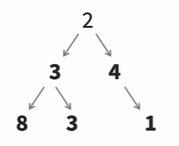
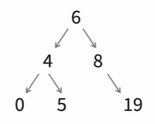

# trees
A collection of nodes where each node can be linked to more nodes.  

Nodes are collected by *links*.  
- Useful for nonlinear data.  
- 2 is the parent (root) node.  
- 3 and 4 are both parent and child nodes.  

## binary trees
A tree whose nodes have no more than 2 children.

## binary search trees  

A binary tree that is ordered.
- Items to the left must be less than the parent.
- Items to the right must be greater than the parent.

