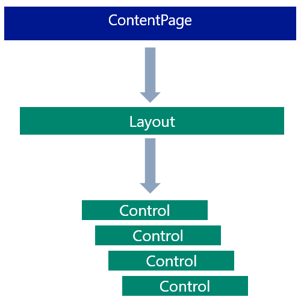
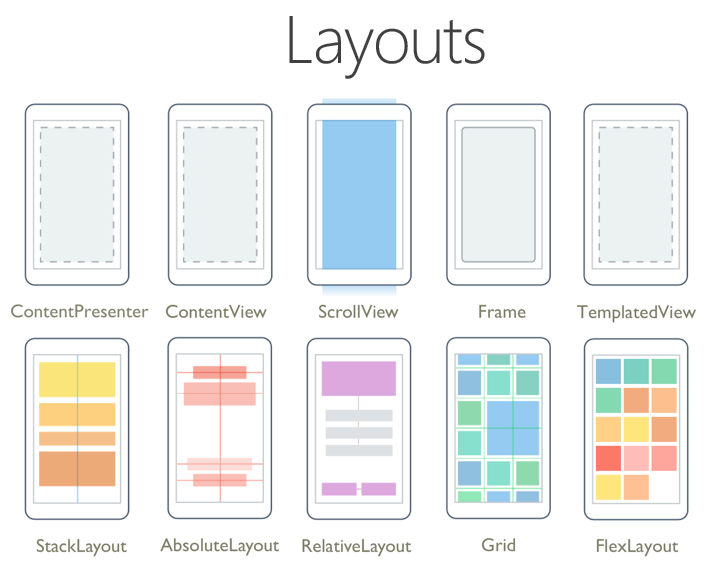
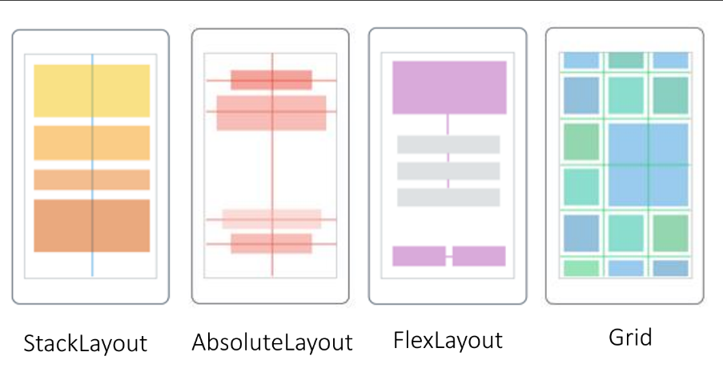

# Application Class
- The `App` class is instantiated and loaded by the boostrap code for each platform.
- It is the model of the application as a whole.
- Inherits default behaviors from `Microsoft.Maui.Controls.Application`.
- Creates an instance of `AppShell` and assigns it to the `MainPage` property.
- Handles lifecycle events (like when the app is sent to the background).

# AppShell Class
An `AppShell`:
- Describes the hierarchy of an app
- Provides a common navigation experience via URIs
- Includes an integrated search handler

An `AppShell` derives from the `Shell` class and contains three main hierarchical objects:
1.  `FlyoutItem` or `TabBar`
    1.  A `FlyoutItem` is used when the app requires a flyout
    2.  A `TabBar` is the bottom tab bar and used when a flyout is not used
    3.  Each `FlyoutItem` or `TabBar` is a child of the `AppShell`.
2.  `Tab` — represented grouped content; navigable from the bottom tabs.
    1.  Each `Tab` is a child of either a `FlyoutItem` or a `TabBar`.
3.  `ShellContent` — The `ContentPage` object for each tab
    1.  Each `ShellContent` is a child of a `Tab`.
    2.  When more than one `ShellContent` exist in a `Tab`, the objects are navigable by the tabs on top of the page.

# ContentPage
`ContentPage` can contain only a single child, either a view or a layout with child views. `ContentPage.Content` property is set to this child.

# Pages
- The root of the UI hierarchy inside of a `Shell`.
- An example is `MainPage`, which derives from `ContentPage`.

## Page Types
- `ContentPage` — simply displays content.
  - A content page can only contain one item (like a `Control`) unless you also have a `Layout`.
- `TabbedPage` — the root page used for tab navigation.
  - Contains child page objects (one for each tab).
- `FlyoutPage` — contains a list of items; when you select that item, a view displaying the details for that item appears.

# Views
- A view enables the developer to retrieve and present data in a specific manner.
- A `ContentPage` displays a view.
- A `ContentView` displays items as-is; if you shrink the view, items may disappear.
- A `ScrollView` displays items in a scrolling window.
- A `CarouselView` allows users to swipe through a collection of items.
- A `CollectionView` can retrieve data from a data source and present each item using a template.

# Controls and Layouts
- *Controls* — buttons, labels, text boxes.
- *Layout* — defines the rules by which controls are displayed.
  - Technically, a layout is also a *control*, so it can be added to a *view*.  



## Common Controls
- `VerticalStackLayout` and `HorizontalStackLayout`
  - Or, `StackLayout`, with a `StackOrientation` property that can be set to `Horizontal` or `Vertical`.
  - This is how screens can change orientation dynamically from portrait to landscape:  


- `AbsoluteLayout` — set exact coordinates for controls.
- `FlexLayout` — like `StackLayout`, but allows wrapping child controls if they don't fit in a single row or column.
  - Includes options for alignment to different screen sizes:  

- `Grid` — lays out controls according to a column and row location the developer defines:  


## Controls: Properties & Events
- All controls have *properties* to alter visualization.
  - Initial values for these properties are defined in XAML.
  - Many proeprties can be modified in C# code.
- Controls have *events* to provide interactive behavior.

## Margin, Padding, and Spacing Properties
- Each control has a `Margin` property to give space between controls.
- Each layout has a `Padding` property to give space between children and the border.
- `VerticalStackLayout` and `HorizonalStackLayout` have a `Spacing` property to give space between children of the layout.
  - This spacing is additive to `Margin`.

# C# & XAML
- Entire pages, views, and layouts can be written in C#.
- Here are two such examples, one written in XAML and one in C#:
## XAML Code
```xml
<ContentPage xmlns="http://schemas.microsoft.com/_net/2021/maui"
             xmlns:x="http://schemas.microsoft.com/winfx/2009/xaml"
             x:Class="Phoneword.MainPage">

    <ScrollView>
        <VerticalStackLayout>
            <Label Text="Current count: 0"
                   Grid.Row="0"
                   FontSize="18"
                   FontAttributes="Bold"
                   x:Name="CounterLabel"
                   HorizontalOptions="Center" />

            <Button Text="Click me"
                    Grid.Row="1"
                    Clicked="OnCounterClicked"
                    HorizontalOptions="Center" />
        </VerticalStackLayout>
    </ScrollView>
</ContentPage>
```

## Equivalent C# Code
```cs
public partial class TestPage : ContentPage
{
    int count = 0;
    // Named Label - declared as a member of the class
    Label counterLabel;

    public TestPage()
    {
        var myScrollView = new ScrollView();

        var myStackLayout = new VerticalStackLayout();
        myScrollView.Content = myStackLayout;

        counterLabel = new Label
        {
            Text = "Current count: 0",
            FontSize = 18,
            FontAttributes = FontAttributes.Bold,
            HorizontalOptions = LayoutOptions.Center
        };
        myStackLayout.Children.Add(counterLabel);
        var myButton = new Button
        {
            Text = "Click me",
            HorizontalOptions = LayoutOptions.Center
        };
        myStackLayout.Children.Add(myButton);

        myButton.Clicked += OnCounterClicked;

        this.Content = myScrollView;
    }

    private void OnCounterClicked(object sender, EventArgs e)
    {
        count++;
        counterLabel.Text = $"Current count: {count}";

        SemanticScreenReader.Announce(counterLabel.Text);
    }
}
```
Then, in `AppShell.xaml`:
```xml
<ShellContent Title="Home" ContentTemplate="{DataTemplate local:TestPage}" Route="TestPage" />
```
