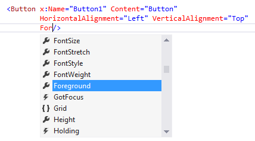
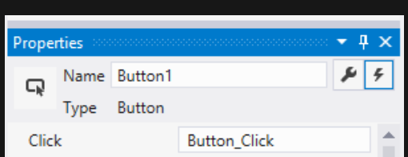
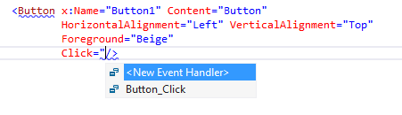

# Overview
*Control* — a UI element that displays content or enables interaction.

[Alphabetical Index of Controls](https://learn.microsoft.com/en-us/windows/apps/design/controls/#alphabetical-index)

## 3 Steps to Using Controls
1.  Add a control to the UI
2.  Set properties on the control
3.  Add code to the control's event handlers

# Add a Control
Use Blend for Visual Studio or Visual Studio XAML Designer or add the control via code.
- Note: controls added via code are not visible in XAML Designer.

# Set the Control's Name and Properties
Set the control's `x:Name` attribute:

```xml
<Button x:Name="Button1" Content="Button"/>
```

Properties can be set in the properties window:  
  

Or in XAML:
```xml
<Button x:Name="Button1" Content="Button" HorizontalAlignment="Left" VerticalAlignment="Top" Foreground="Beige"/>
```
Or in code:
```cs
Button1.Foreground = new SolidColorBrush(Windows.UI.Colors.Beige);
```

# Create an Event Handler
Select the control and then click the Events tab at the top of the Properties window:  
  

Or in code:
```cs
private void Button_Click(object sender, RoutedEventArgs e)
{
    Button b = (Button)sender;
    b.Foreground = new SolidColorBrush(Windows.UI.Colors.Blue);
}
```
Or in XAML — then, double-click `<New Event Handler>`:  


Associate an event with its event handler in code:
```cs
Button1.Click += new RoutedEventHandler(Button_Click);
```
