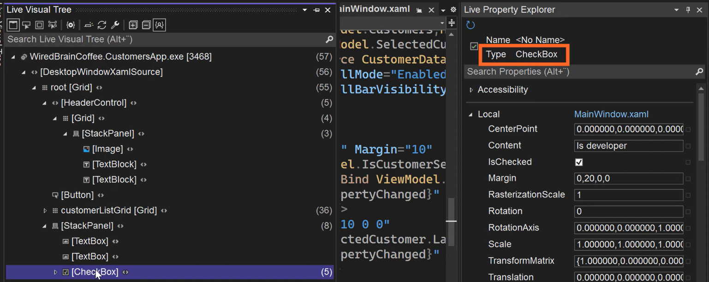

# Live Visual Tree
**Debug** > **Windows** > **Live Visual Tree**

Toggle between showing all WinUI XAML or just XAML you have written:  
    

Show all elements in the MainWindow:  
    

The numbers indicate how many children (direct and indirect) each element contains:  
    

Click to enable a toolbar that floats over the app UI:  
  

Select Element—select an element in UI and it will be selected in Live Visual Tree:  
  

Click brackets to navigate to this element:  
  

# Inspecting Properties at Runtime with Live Property Explorer
  

  

Live Property Explorer always shows the properties of the element selected in the Live Visual Tree:  
   

   

This Padding property is crossed out because it is set by a more specific Style.  

Changes made to values in Live Property Explorer do not persist.  
