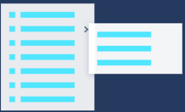
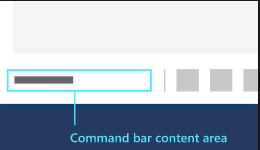

# Overview
*Command elements* are interactive UI elements that let users perform actions (send an email, delete an item, submit a form). *Command interfaces* are composed of common command elements, the command surfaces that host them, the interactions they support, and the experience they provide.

## Command elements
- Buttons—trigger an immediate action
- Lists—present items in an interactive list or grid (drop-down list, list box, list view, grid view)
- Selection controls—select from a few options (CheckBox, RadioButton, toggle switch)
- Calendar, date and time pickers—view/modify date and time info (calendar date picker, calendar view, date picker, time picker)
- Predictive text entry—Provide suggestions as users type (AutoSuggestBox)

## Command surfaces
- App canvas (content area)  

- Command bars and menu bars  

- Menus and context menus—CommandBarFlyout  

# Providing Command Feedback
- Command bar  

- Flyouts—lightweight contextual popups  

- Dialog controls—usually must be explictly dismissed  

