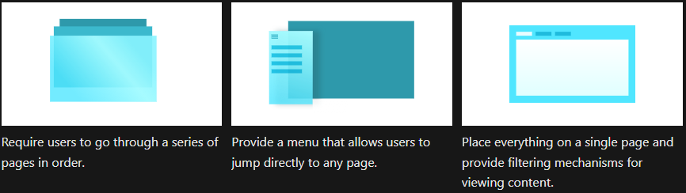
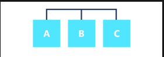
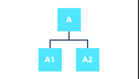
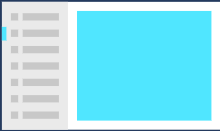

# Overview
An app is a collection of *pages*. *Navigation* is the act of moving between pages and within a page.

# Navigation Structures
## Flat/Lateral
- Pages exist side by side
- Able to navigate from one page to another in any order  

## Hierarchical
- Each child page has one parent, but a parent can have
more than one child.
- To reach a child page, you must navigate through parent.  

# Navigation Controls
## Frame
- Any app with multiple pages uses a Frame
- The app's main page contains a Frame and a primary navigation
element like a navigation view control.  

## Top Navigation (NavigationView)
- A horizontal list of links to pages on the same level
- Use when
  - you want to show all navigation options on the screen
  - you need more space for app's content
  - icons cannot describe your navigation categories

## Tabs (TabView)
- A horizontal set of tabs and their respective content
- Use when
  - you want users to be able to open, close, or rearrange tabs
  - you expect there might be a large number of tabs open at once
  - your users need to easily move tabs between windows  

## Breadcrumb (BreadcrumbBar)
- A horizontal list of links to pages at each of the higher levels
- Use when
  - you want to show the path to the current location
  - you have many levels of navigation

## Left navigation
- A vertical list of links to top-level pages
- Use when
  - the pages exist at the top level
  - there are 5+ navigation items
  - users don't switch between pages frequently  

## List/details
- Displays a list of items
- Use when
  - users need to switch between child items frequently  

