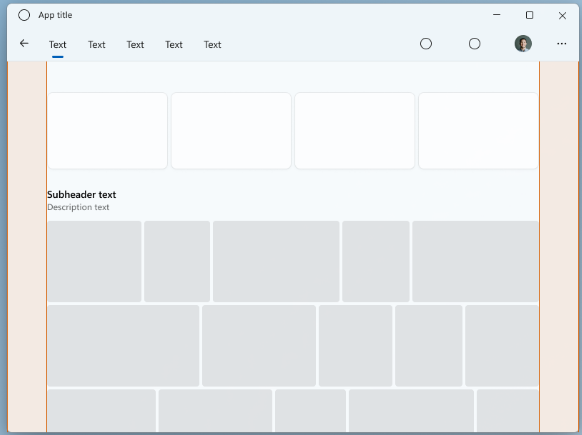
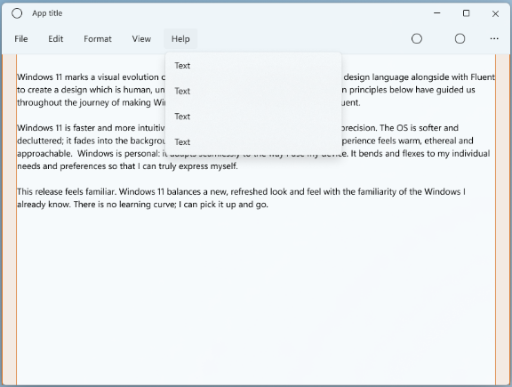
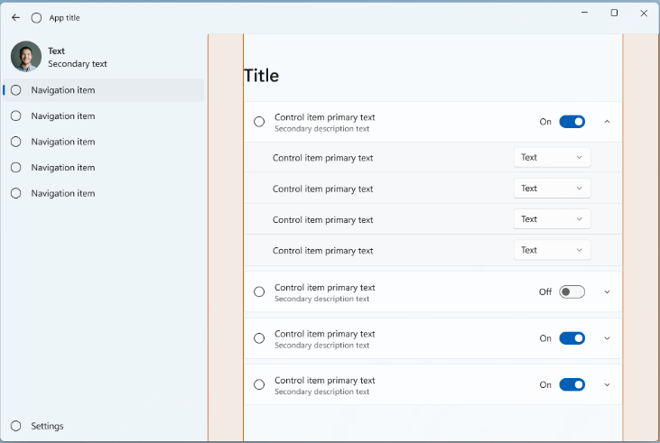
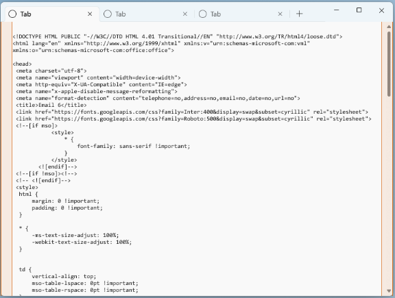

# App Silhouettes
Common pattern of relationship between elements such as app layering, menus, navigation, commanding, and content areas.

## Top Navigation silhouette
- NavigationView is used in content layer
- Navigation is on same row as commands  
  

## Menu Bar silhouette
- MenuBar used as the base layer along with a CommandBar  
  

## Left Navigation silhouette
- NavigationView on top of app's base layer  
  

## Tab View silhouette
- TabView on app's base layer  
  

## Title bar
TODO...