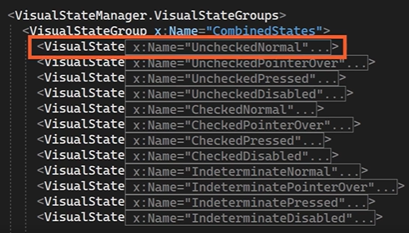
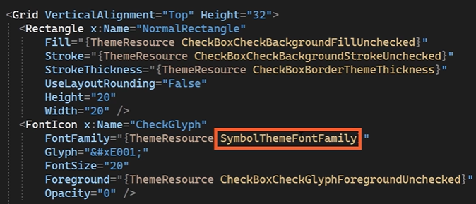

# Create a Control Template
Create a copy of the default `ControlTemplate` for `CheckBox`:  

Solution Explorer > **Dependencies** > **Packages** > **Microsoft.WindowsAppSDK** …  
This package contains the WinUI library and a generic.xaml file that contains all the styles for the controls of WinUI.  

… Right-click **Microsoft.WindowsAppSDK** > **Open file in Explorer** > **lib** > **net6.0-windows.10.x.y.z** > **Microsoft.WinUI** > **Themes** > **generic.xaml**  

`generic.xaml`  
  
Copy the above Style.  

`Resources/Styles.xaml`  
Paste the style for the `CheckBox` copied from `generic.xaml`:

  

The `CheckBox` is actually a `Grid`:  
  

The `VisualStateGroups` define the UI of the `CheckBox` based on its state. For example, if the `CheckBox` is unchecked, then `UncheckedNormal` is active:  
  

The `CheckBox` (`Grid`) contains two column definitions:  
  

The first `ColumnDefinition` has a `Rectangle` and a `FontIcon` which is actually the checkmark (defined in its `Glyph` property):  
  

This `ContentPresenter` displays the `Content` of the `CheckBox`:  
  

To change the checkmark, go to the **FontIcon** > right-click **SymbolThemeFontFamily** > **Go to definition**:  
  

This takes you to `generic.xaml`  
  

Searching for these fonts takes you to [Microsoft Docs](https://docs.microsoft.com/en-us/windows/apps/design/style/segoe-fluent-icons-font) with other icons and descriptions. The one we want is the X which has a Unicode point of `e711`.

`Styles.xaml`  
Change the `Glyph`, which currently uses Unicode point `E001` to `E711`:

