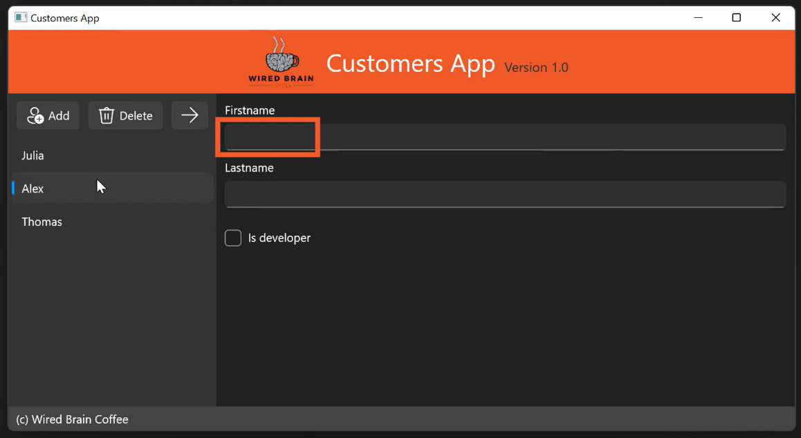

# Data Binding
- Linking properties of objects in the View to those in the Data layer so that changes in one are reflected in the other.
- Makes event handlers unnecessary.
- Can be implemented in XAML or code, but more common in XAML.

Bind the `Firstname` textbox to the selected item in the `ListView`:



This is the ListView that holds the names. Add an `x:Name` to it:
```xml
<!-- ... -->
    <ListView Grid.Row="1" x:Name="customerListView"
        ScrollViewer.HorizontalScrollMode="Enabled"
        ScrollViewer.HorizontalScrollBarVisibility="Auto">
        <ListViewItem>Julia</ListViewItem>
        <ListViewItem>Alex</ListViewItem>
        <ListViewItem>Thomas</ListViewItem>
    </ListView>
</Grid>

<!-- Customer detail -->
<StackPanel Grid.Row="1" Grid.Column="1" Margin="10">
    <!-- Create a data binding:  -->
    <TextBox Header="Firstname" Text="`{Binding ElementName=customerListView, Path=SelectedItem.Content Mode=TwoWay}`"/>
    <TextBox Header="Lastname" Margin="0 10 0 0"/>
    <CheckBox Margin="0 20 0 0">
        Is developer
    </CheckBox>
</StackPanel>
```

# Data Sources for Binding
ElementName can be used as a data source for a data binding:
```xml
<TextBlock Text="{Binding ElementName=…}"/>
```

Source can be used with a StaticResource for a data binding:
```xml
<TextBlock Text="{Binding Source={StaticResource myRes}}"/>
```

`RelativeSource` property allows you to bind to another element in the XAML document *relatively*.  
For example, the `Height` property of this `Rectangle` can be bound to its `Width` property:
```xml
<Rectangle Fill="Red" Width="300" Height="{Binding RelativeSource={RelativeSource Self}, Path=Width}"/>
```

## `DataContext`
Every element in WinUI has a `DataContext` property of type `object`.  

`DataContext` is used if `ElementName`, `Source`, and `RelativeSource` are not used:  
```xml
<Grid DataContext="Pluralsight">
    <StackPanel> <!-- If `DataContext` was set here, the one above would NOT be used. -->
        <TextBlock Text="{Binding}"/> <!-- Looks into `DataContext` property of `TextBlock`; this is empty, so then checks `StackPanel`; empty, so checks `Grid` -->
    </StackPanel>
</Grid>
```

Setting the `DataContext` to a complex object and then binding to the properties of that object is the essence of the MVVM pattern.

# Binding mode
Each View can have only only one `BindingContext`; multiple data bindings on a view must all reference properties on the same object.
To solve for this, the `BindingMode` can be set to:
- `OneWay`: values are transferred from source —> target (every time the source changes)
- `OneWayToSource`: source <— target
- `TwoWay`: source <—> target (every time the source or target changes)
- `OneTime`: source —> target (only one time)

