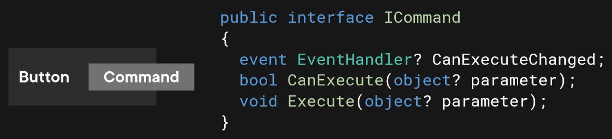
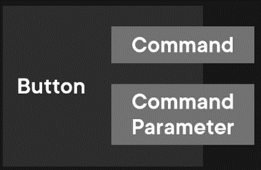
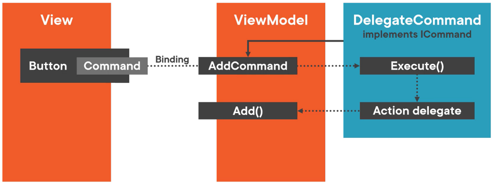

# first technique to execute logic in a viewmodel
Bind events to methods with `x:Bind`  

Assume an `Add` method in the ViewModel that should be called every time a `Button` is clicked in the View:

## okay approach
Use the `Button`'s `Click` event; install an event handler in the View's code-behind file:  


Disadvantage: An event handler needs to be installed in the code-behind file for every method of the ViewModel that needs to be called.  

## Better Approach: Bind Events to Methods with x:Bind
Bind the `Click` event to the `Add` method with `x:Bind`:  


`MainViewModel.cs`
```cs
// …

public void Add()
{
    var customer = new Customer { FirstName = "New" };
    var viewModel = new CustomerItemViewModel(customer);
    Customer.Add(viewModel);
    SelectedCustomer = viewModel;
}
```

`MainWindow.xaml`
```xml
<!-- ... -->
<!-- Bind the Click event to the Add method: -->
<Button Margin="10" Click="{x:Bind ViewModel.Add}">
    <StackPanel Orientation="Horizontal">
        <SymbolIcon Symbol="AddFriend"/>
        <TextBlock Text="Add" Margin="5 0 0 0"/>
    </StackPanel>
</Button>
```
# second technique to execute logic in a viewmodel
Use Commands.

Assume that the user can only use the `Add` method (via the `Button)` when a certain condition is met:  

## okay approach
Add a `CanAdd` property to the ViewModel and a `IsEnabled` property to the View, then `x:Bind` them. When the `CanAdd` condition is met, the `Button` is enabled:  


## Better Approach: Use Commands
Button's have a `Command` property:  


Create a class that implements this interface. Assign an instance of that class to the `Button`'s `Command` property. When `Button` is clicked, it will call the `Execute` method of its `Command.`  

When `Button`'s `Command` property is set, `Button` will call the `CanExecute` method of `Command.` It uses return value to set its own `IsEnabled` property.  

`Button` subscribes to `CanExecuteChanged` event of the `Command.` When `Command` raises this event, `Button` will call `CanExecute` method again.  

Note that `CanExecute` and `Execute` accept a parameter of type `object.`  

Optionally, set the `Button`'s `CommandParameter` property to specify the parameter's type:  


To use the `Command`, create an `AddCommand` property in the ViewModel of type `ICommand`.
Then, bind the `Button`'s `Command` property in the View to the `AddCommand` property in the ViewModel:  


To trigger the `Add` method when the `AddCommand` property is set:
- Build a `DelegateCommand : ICommand` class (the `DelegateCommand` might also be called `ActionCommand` or `RelayCommand`
- The ViewModel creates an instance of this class and assigns it to its own `AddCommand` property
- ViewModel, when constructing DelegateCommand, will pass an Action delegate that points to the Add method of the ViewModel:  


When the `Button` is clicked, the `Execute` method of `DelegateCommand` is called.  
The `Execute` method calls the `Action` delegate which points to the `Add` method of the ViewModel:  


