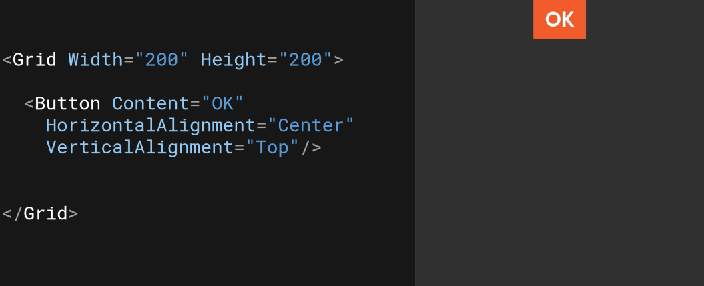
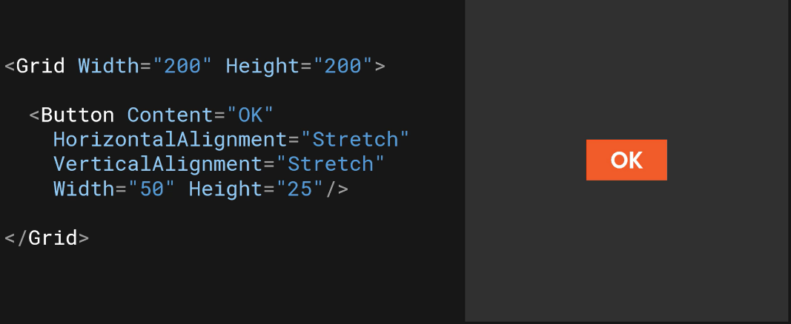

# Positioning Elements with Layout Properties
  

`HorizontalAlignment` property has values of `Left`, `Center`, `Right`, `Stretch`  
`VerticalAlignment` property has values of `Top`, `Center`, `Bottom`, `Stretch`  

When `Width` and `Height` properties are set, the element will not grow or shrink:  
  

## Margin
`Margin="<Left Top Right Bottom>"`  
`Margin="50"` results in a margin of 50 pixels on all sides.  
`Margin="50 10"` results in 50 pixels for left and right margins and 10 pixels for top and bottom margins.  

