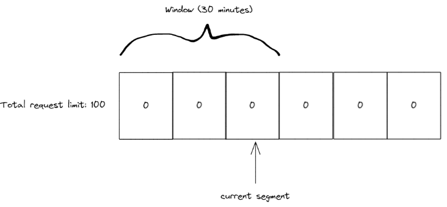
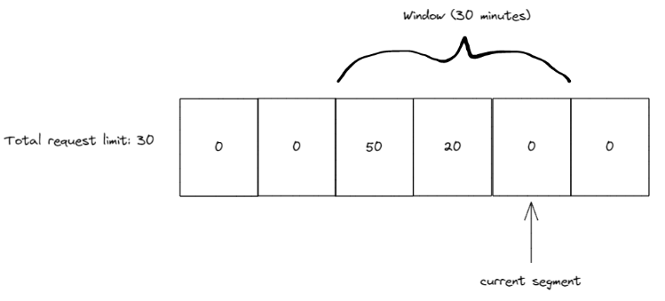

# overview
> [!IMPORTANT]
> Availability: .NET 7  

Rate limiting is built into .NET 7.  

# Built-in Rate Limiting Algorithms
Namespace `System.Threading.RateLimiting ` 
Abstract type `RateLimiter`  

Use:
```cs
RateLimiter limiter = new ConcurrencyLimiter(
    new ConcurrencyLimiterOptions(
        permitLimit: 2,
        queueProcessingOrder: QueueProcessingOrder.OldestFirst,
        queueLimit: 2
    ));
```
## concurrency limit
Define a maximum number of concurrent requests that can access a resource.

## token bucket limit
- A bucket is filled with tokens.
- Each request permanently consumes a token.
- At interval, more tokens are added to the bucket.

## fixed window limit
- During a window of X minutes, Y requests are allowed.
- After X minutes, Y more requests are allowed.

## sliding window limit





## partitioned rate limiter

# rate limiting middleware
Namespace `Microsoft.AspNetCore.RateLimiting`

# Client-side Rate Limiting
1. Implement a custom `DelegatingHandler` subclass to intercept and handle requests before they are sent to the server:
    ```cs
    internal sealed class ClientSideRateLimitedHandler : DelegatingHandler, IAsyncDisposable
    {
        private readonly RateLimiter _rateLimiter;

        // This class receives a RateLimiter when it is constructed:
        public ClientSideRateLimitedHandler(RateLimiter limiter) : base(new HttpClientHandler()) => _rateLimiter = limiter;
        
        // This method is overridden to intercept and handle requests before they are sent to the server:
        protected override async Task<HttpResponseMessage> SendAsync(
            HttpRequestMessage request, CancellationToken cancellationToken)
        {
            // Get a RateLimitLease from the RateLimiter:
            using RateLimitLease lease = await _rateLimiter.AcquireAsync(permitCount: 1, cancellationToken);

            if (lease.IsAcquired)
            {
                // If the lease is acquired, the request is sent to the server:
                return await base.SendAsync(request, cancellationToken);
            }

            // Otherwise, prepare an HTTP/429 response:
            var response = new HttpResponseMessage(HttpStatusCode.TooManyRequests);

            // If the lease has a RetryAfter value, set the Retry-After header to that value:
            if (lease.TryGetMetadata(MetadataName.RetryAfter, out TimeSpan retryAfter))
            {
                response.Headers.Add(
                    "Retry-After",
                    ((int)retryAfter.TotalSeconds).ToString(NumberFormatInfo.InvariantInfo)
                );
            }
            
            return response;
        }

        // RateLimiters must be disposed:
        async ValueTask IAsyncDisposable.DisposeAsync()
        { 
            await _rateLimiter.DisposeAsync().ConfigureAwait(false);

            Dispose(disposing: false);
            
            GC.SuppressFinalize(this);
        }

        protected override void Dispose(bool disposing)
        {
            base.Dispose(disposing);

            if (disposing)
            {
                _rateLimiter.Dispose();
            }
        }
    }
    ```

2. Emulate many concurrent requests with a console app that creates an HttpClient with the ClientSideRateLimitedHandler
    ```cs
    var options = new TokenBucketRateLimiterOptions
    { 
        TokenLimit = 8, 
        QueueProcessingOrder = QueueProcessingOrder.OldestFirst,
        QueueLimit = 3, 
        ReplenishmentPeriod = TimeSpan.FromMilliseconds(1), 
        TokensPerPeriod = 2, 
        AutoReplenishment = true
    };
    
    // Create an HTTP client with the client-side rate limited handler.
    using HttpClient client = new(
        handler: new ClientSideRateLimitedHandler(
        limiter: new TokenBucketRateLimiter(options)));

    // Create 100 urls with a unique query string.
    var oneHundredUrls = Enumerable.Range(0, 100).Select(i => $"https://example.com?iteration={i:0#}");
    
    // Flood the HTTP client with requests.
    var floodOneThroughFortyNineTask = Parallel.ForEachAsync(
        source: oneHundredUrls.Take(0..49), 
        body: (url, cancellationToken) => GetAsync(client, url, cancellationToken));
    
    var floodFiftyThroughOneHundredTask = Parallel.ForEachAsync(
        source: oneHundredUrls.Take(^50..),
        body: (url, cancellationToken) => GetAsync(client, url, cancellationToken));
    
    await Task.WhenAll(floodOneThroughFortyNineTask, floodFiftyThroughOneHundredTask);
    
    static async ValueTask GetAsync(HttpClient client, string url, CancellationToken cancellationToken)
    {
        using var response = await client.GetAsync(url, cancellationToken);
        
        Console.WriteLine($"URL: {url}, HTTP status code: {response.StatusCode} ({(int)response.StatusCode})");
    }
   ```
