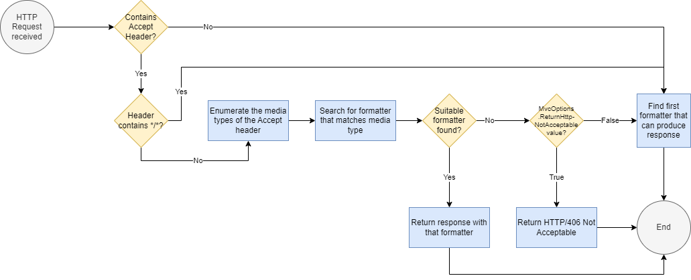

# [Overview](https://learn.microsoft.com/en-us/aspnet/core/web-api/advanced/formatting?view=aspnetcore-7.0)  

Some actions, like those that derive from `ActionResult` like `JsonResult` and `ContentResult`, return results in specific formats (JSON and plain text, respectively). Others, like actions that return objects that are not `IActionResult` types, are serialized with an `IOutputFormatter`. 

By default, `Ok` returns JSON-formatted data:
```cs
[HttpGet]
public IActionResult Get()
    => Ok(_todoItemStore.GetList());

```

To return plain text, use `ContentResult` and `Content`:
```cs
[HttpGet("Version")]
public ContentResult GetVersion()
    => Content("v1.0.0");
 ```

 For actions with multiple return types, return `IActionResult`.

 # Content Negotiation
 *Content negotiation* occurs when a client specifies an `Accept` header. Content negotiation is built into the code-specific action results return from helper methods. These methods are based on ObjectResult, which implements content negotiation.

```cs
[HttpGet("{id:long}")]
public IActionResult GetById(long id)
{
    var todo = _todoItemStore.GetById(id);
    
    if (todo is null)
        return NotFound();
    
    return Ok(todo);
}
```

Actions can return POCOs. When they do, the runtime creates an `ObjectResult` that wraps the POCO and the client receives the serialized object in the response. If the object is `null`, HTTP 204/No Content is returned.

## accept header
When an HTTP request is received, ASP.NET Core follows this flow chart for content negotiation:  


# Configuring Formatters [[Documentation](https://learn.microsoft.com/en-us/aspnet/core/web-api/advanced/formatting?view=aspnetcore-7.0#configure-formatters-2)]  

There are separate formatters for input and output. Output formatters are used to format responses. Input formatters are used by model binding.

- [Add XML format support](https://learn.microsoft.com/en-us/aspnet/core/web-api/advanced/formatting?view=aspnetcore-7.0#add-xml-format-support-2)
- [Configure System.Text.Json-based formatters](https://learn.microsoft.com/en-us/aspnet/core/web-api/advanced/formatting?view=aspnetcore-7.0#configure-systemtextjson-based-formatters-2)
- [Format ProblemDetails and ValidationProblemDetails responses](https://learn.microsoft.com/en-us/aspnet/core/web-api/advanced/formatting?view=aspnetcore-7.0#format-problemdetails-and-validationproblemdetails-responses)

# specify a format
Response formats can be restricted with the [Produces] filter.
> Documentation: https://learn.microsoft.com/en-us/aspnet/core/web-api/advanced/formatting?view=aspnetcore-7.0#specify-a-format-2

# special case formatters
Some special cases are implemented with built-in formatters.
> Documentation: https://learn.microsoft.com/en-us/aspnet/core/web-api/advanced/formatting?view=aspnetcore-7.0#special-case-formatters-2

# response format url mappings
Clients can request a particular format as part of the URL.
> Documentation: https://learn.microsoft.com/en-us/aspnet/core/web-api/advanced/formatting?view=aspnetcore-7.0#response-format-url-mappings-2

# custom formatters
Custom formatters can be created.
> Documentation: https://learn.microsoft.com/en-us/aspnet/core/web-api/advanced/custom-formatters?view=aspnetcore-7.0
