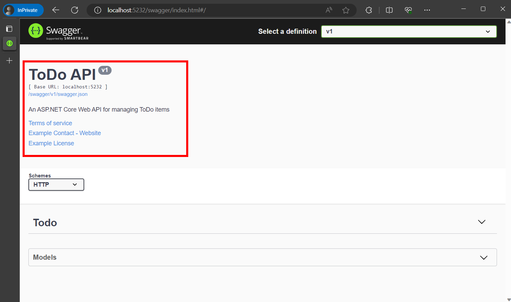
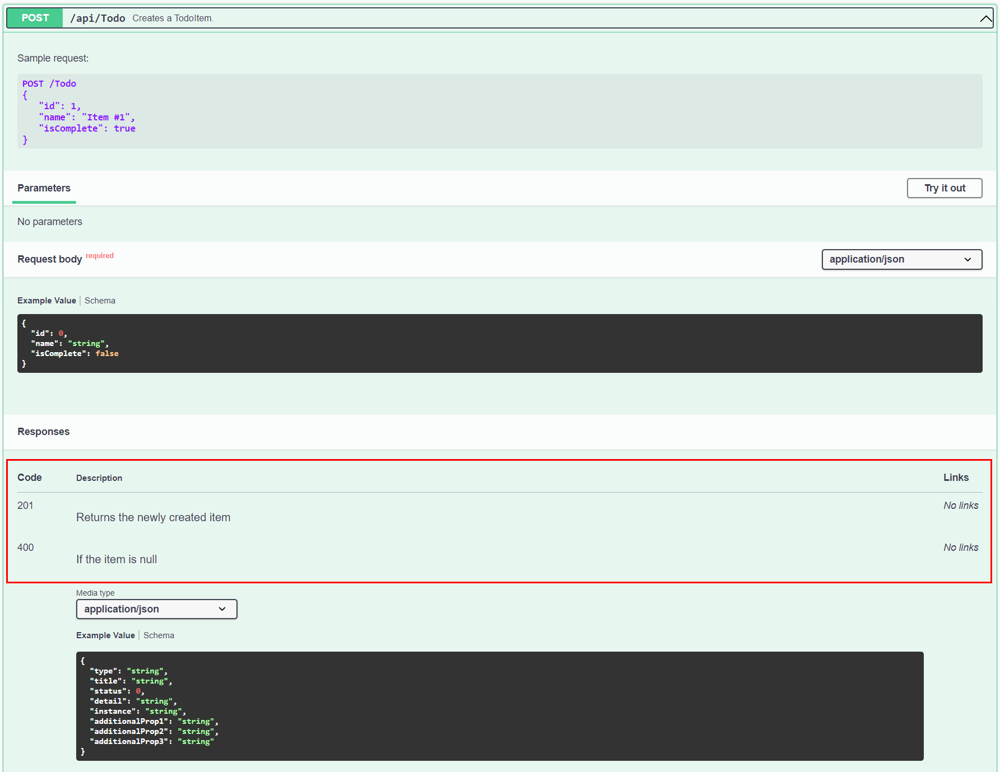

# [Overview](https://learn.microsoft.com/en-us/aspnet/core/tutorials/getting-started-with-nswag?view=aspnetcore-7.0&tabs=visual-studio)  
NSwag is an implementation of OpenAPI in ASP.NET Core.

Unlike [Swashbuckle](../swashbuckle/), it also includes code generation capabilities.

# installation
```powershell
dotnet add package NSwag.AspNetCore
```

# configuration
`Program.cs`
```cs 
// ...
var builder = WebApplication.CreateBuilder(args);

builder.Services.AddControllers();
builder.Services.AddOpenApiDocument();

if (app.Environment.IsDevelopment())
{
    // Add OpenAPI 3.0 document serving middleware
    // Available at: http://localhost:<port>/swagger/v1/swagger.json
    app.UseOpenApi();

    // Add web UIs to interact with the document
    // Available at: http://localhost:<port>/swagger
    app.UseSwaggerUi3();
}
// ...
```

## configuring api information and description
`Program.cs`
```cs
// ...
using NSwag;

var builder = WebApplication.CreateBuilder(args);

builder.Services.AddOpenApiDocument(options => {
     options.PostProcess = document =>
     {
         document.Info = new OpenApiInfo
         {
             Version = "v1",
             Title = "ToDo API",
             Description = "An ASP.NET Core Web API for managing ToDo items",
             TermsOfService = "https://example.com/terms",
             Contact = new OpenApiContact
             {
                 Name = "Example Contact",
                 Url = "https://example.com/contact"
             },
             License = new OpenApiLicense
             {
                 Name = "Example License",
                 Url = "https://example.com/license"
             }
         };
     };
});
// ...
```

## configuring xml comments
XML comments enables debug information for undocumented types and members. Most features require an XML file.

### enabling xml comments
1. Update the project file:  
    `SomeProject.csproj`
    ```xml
    <PropertyGroup>
    <GenerateDocumentationFile>true</GenerateDocumentationFile>
    </PropertyGroup>
    ```
2. To suppress certain warnings, use a `NoWarn` property. This example ignores CS1591. More warning codes can be added to the semicolon-delimited list:
    ```xml
    <PropertyGroup>
    <GenerateDocumentationFile>true</GenerateDocumentationFile>
    <NoWarn>$(NoWarn);1591</NoWarn>
    </PropertyGroup>
    ```
3. Customize the API documentation:
    `Program.cs`  
    ```cs
    builder.Services.AddSwaggerGen(options =>
    {
        options.SwaggerDoc("v1", new OpenApiInfo
        {
            Version = "v1",
            Title = "ToDo API",
            Description = "An ASP.NET Core Web API for managing ToDo items",
            TermsOfService = new Uri("https://example.com/terms"),
            Contact = new OpenApiContact
            {
                Name = "Example Contact",
                Url = new Uri("https://example.com/contact")
            },
            License = new OpenApiLicense
            {
                Name = "Example License",
                Url = new Uri("https://example.com/license")
            }
        });
    });
    ```

This renders:  


# using swagger
## accessing swagger
Navigate to `https://localhost:<port>/swagger/v1/swagger.json`.  This should match `openapi.json` in the project.

To access the Swagger UI, navigate to `https://localhost:<port>/swagger`.

## applying xml comments
1. Add triple-slash comments to an action:
    ```cs
    /// <summary>
    /// Creates a TodoItem.
    /// </summary>
    /// <param name="item"></param>
    /// <returns>A newly created TodoItem</returns>
    /// <remarks>
    /// Sample request:
    ///
    ///     POST /Todo
    ///     {
    ///        "id": 1,
    ///        "name": "Item #1",
    ///        "isComplete": true
    ///     }
    ///
    /// </remarks>
    /// <response code="201">Returns the newly created item</response>
    /// <response code="400">If the item is null</response>
    [HttpPost]
    [ProducesResponseType(StatusCodes.Status201Created)]
    [ProducesResponseType(StatusCodes.Status400BadRequest)]
    public async Task<IActionResult> Create(TodoItem item)
    {
        _context.TodoItems.Add(item);
        await _context.SaveChangesAsync();

        return CreatedAtAction(nameof(Get), new { id = item.Id }, item);
    }
    ```
    This renders:  
    
2. Add data annotations to the model: 
    ```cs
    using System.ComponentModel;
    using System.ComponentModel.DataAnnotations;

    namespace SwashbuckleSample.Models;

    public class TodoItem
    {
        public long Id { get; set; }

        [Required]
        public string Name { get; set; } = null!;

        [DefaultValue(false)]
        public bool IsComplete { get; set; }
    }
    ```

3. Add attributes to the controllers:
    ```cs
    [ApiController]
    [Route("api/[controller]")]
    [Produces("application/json")]
    public class TodoController : ControllerBase
    {
        // ...
    }
    ```

*API conventions* can be used in place of attributes if desired.

# redoc
[Redoc](https://github.com/Redocly/redoc) is an alternative to Swagger UI that is more focused on documentation and does not provide an interactive UI.

Redoc is configured and used like NSwag and Swashbuckle with a different setup in `Program.cs`:  
```cs
if (app.Environment.IsDevelopment())
{
    // Add OpenAPI 3.0 document serving middleware
    // Available at: http://localhost:<port>/swagger/v1/swagger.json
    app.UseOpenApi();

    // Add web UIs to interact with the document
    // Available at: http://localhost:<port>/swagger
    app.UseSwaggerUi3();
    
    // Add ReDoc UI to interact with the document
    // Available at: http://localhost:<port>/redoc
    app.UseReDoc(options =>
    {
        options.Path = "/redoc";
    });
}
```