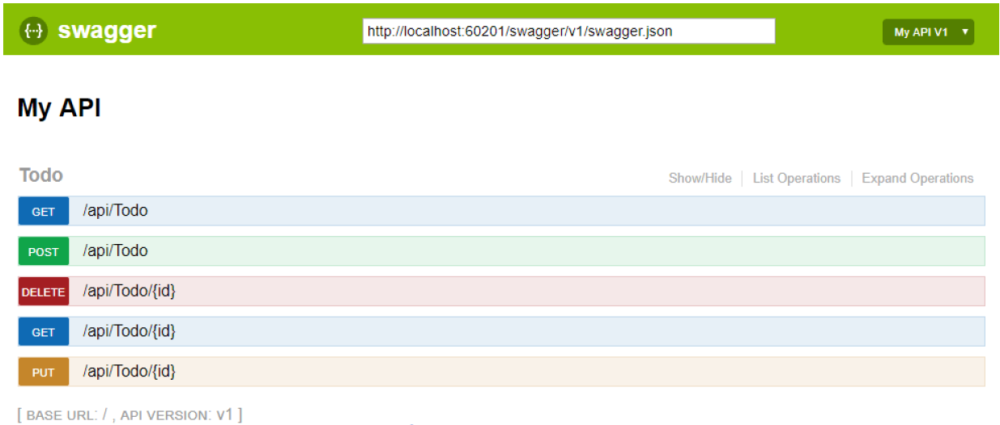

# [Overview](https://learn.microsoft.com/en-us/aspnet/core/tutorials/web-api-help-pages-using-swagger?view=aspnetcore-7.0)  
- *OpenAPI* — a language-agnostic specification for describing REST APIs.
- *Swagger*
  - OpenAPI started as Swagger; Swagger was donated to the OpenAPI Initiative in 2015.
  - Swagger is a family of open source and commercial products from SmartBear that work with the OpenAPI specification.

# openapi spec 
A document, usually `openapi.json`, that describes the capabilities of an API.
- It is generated from the XML and attribute annotations within controllers and models.

<details>
<summary>
Example:  

</summary>

`openapi.json`
```json
{
  "openapi": "3.0.1",
  "info": {
    "title": "API V1",
    "version": "v1"
  },
  "paths": {
    "/api/Todo": {
      "get": {
        "tags": [
          "Todo"
        ],
        "operationId": "ApiTodoGet",
        "responses": {
          "200": {
            "description": "Success",
            "content": {
              "text/plain": {
                "schema": {
                  "type": "array",
                  "items": {
                    "$ref": "#/components/schemas/ToDoItem"
                  }
                }
              },
              "application/json": {
                "schema": {
                  "type": "array",
                  "items": {
                    "$ref": "#/components/schemas/ToDoItem"
                  }
                }
              },
              "text/json": {
                "schema": {
                  "type": "array",
                  "items": {
                    "$ref": "#/components/schemas/ToDoItem"
                  }
                }
              }
            }
          }
        }
      },
      "post": {
        …
      }
    },
    "/api/Todo/{id}": {
      "get": {
        …
      },
      "put": {
        …
      },
      "delete": {
        …
      }
    }
  },
  "components": {
    "schemas": {
      "ToDoItem": {
        "type": "object",
        "properties": {
          "id": {
            "type": "integer",
            "format": "int32"
          },
          "name": {
            "type": "string",
            "nullable": true
          },
          "isCompleted": {
            "type": "boolean"
          }
        },
        "additionalProperties": false
      }
    }
  }
}
```
</details>

# swagger ui
A tool from SmartBear that provides a web-based UI with information about an API service:  


There are two implementations of OpenAPI in .NET: Swashbuckle and NSwag.  Both include an embedded version of Swagger UI.