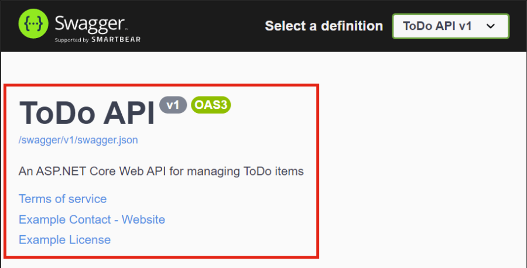
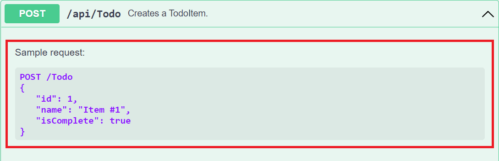
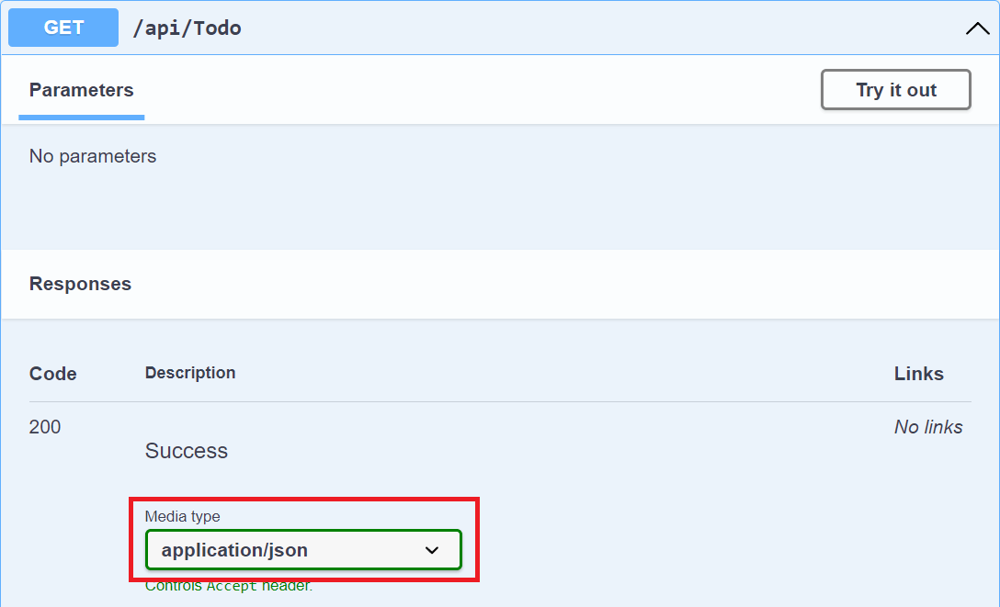

# [Overview](https://learn.microsoft.com/en-us/aspnet/core/tutorials/getting-started-with-swashbuckle?view=aspnetcore-7.0&tabs=netcore-cli)  
Swashbuckle is an implementation of OpenAPI in ASP.NET Core.

It has 3 main components:
1. `Swashbuckle.AspNetCore.Swagger` — a Swagger object model and middleware
2. `Swashbuckle.AspNetCore.SwaggerGen` — a Swagger generator that builds a SwaggerDocument from routes, controllers and models
3. `Swashbuckle.AspNetCore.SwaggerUI` — an embedded version of Swagger UI 

# Installation
```powershell
dotnet add package swashbuckle.aspnetcore
```

# Configuration
`Program.cs`
```cs {hl_lines=[5,8]}
// ...
builder.Services.AddControllers();

// This is required for minimal APIs:
builder.Services.AddEndpointsApiExplorer();

// Adds the Swagger generator:
builder.Services.AddSwaggerGen();

if (app.Environment.IsDevelopment())
{
    // serve the generated JSON document:
    app.UseSwagger();

    // serve the Swagger UI:
    app.UseSwaggerUI(options =>
    {
        options.SwaggerEndpoint("/swagger/v1/swagger.json", "v1");

        // required if injecting a custom stylesheet to brand the Swashbuckle components:
        options.InjectStylesheet("/swagger-ui/custom.css");
   
        // with this option, access the Swagger UI at https://localhost:<port>
        // otherwise, access it at https://localhost:<port>/swagger:
        options.RoutePrefix = string.Empty;
        
        // use this option to use OpenAPI version 2.0 (default = false (3.0)):
        options.SerializeAsV2 = true;
    });
}
// ...

// these calls are required if branding the Swashbuckle components:
app.UseHttpsRedirection();
app.UseStaticFiles();
app.MapControllers();
```

## Configuring API Information and Description
`Program.cs`
```cs
// ...
builder.Services.AddSwaggerGen(options =>
{
    options.SwaggerDoc("v1", new OpenApiInfo
    {
        Version = "v1",
        Title = "ToDo API",
        Description = "An ASP.NET Core Web API for managing ToDo items",
        TermsOfService = new Uri("https://example.com/terms"),
        Contact = new OpenApiContact
        {
            Name = "Example Contact",
            Url = new Uri("https://example.com/contact")
        },
        License = new OpenApiLicense
        {
            Name = "Example License",
            Url = new Uri("https://example.com/license")
        }
    });
});
// ...
```

## Configuring XML Comments
XML comments enables debug information for undocumented types and members. Most features require an XML file.

### Enabling XML Comments
1. Update the project file:  
    `SomeProject.csproj`
    ```xml
    <PropertyGroup>
    <GenerateDocumentationFile>true</GenerateDocumentationFile>
    </PropertyGroup>
    ```
2. To suppress certain warnings, use a `NoWarn` property. This example ignores CS1591. More warning codes can be added to the semicolon-delimited list:
    ```xml
    <PropertyGroup>
    <GenerateDocumentationFile>true</GenerateDocumentationFile>
    <NoWarn>$(NoWarn);1591</NoWarn>
    </PropertyGroup>
    ```
3. Configure Swagger UI to use the XML file:
    `Program.cs`  
    ```cs
    builder.Services.AddSwaggerGen(options =>
    {
        options.SwaggerDoc("v1", new OpenApiInfo
        {
            Version = "v1",
            Title = "ToDo API",
            Description = "An ASP.NET Core Web API for managing ToDo items",
            TermsOfService = new Uri("https://example.com/terms"),
            Contact = new OpenApiContact
            {
                Name = "Example Contact",
                Url = new Uri("https://example.com/contact")
            },
            License = new OpenApiLicense
            {
                Name = "Example License",
                Url = new Uri("https://example.com/license")
            }
        });

        // using System.Reflection;
        var xmlFilename = $"{Assembly.GetExecutingAssembly().GetName().Name}.xml";
        options.IncludeXmlComments(Path.Combine(AppContext.BaseDirectory, xmlFilename));
    });
    ```

This renders:  


# Using Swagger
## Accessing Swagger
Navigate to `https://localhost:<port>/swagger/v1/swagger.json`.  This should match `openapi.json` in the project.

To access the Swagger UI, navigate to `https://localhost:<port>/swagger`.

## Applying XML Comments
1. Add triple-slash comments to an action:
    ```cs
    /// <summary>
    /// Creates a TodoItem.
    /// </summary>
    /// <param name="item"></param>
    /// <returns>A newly created TodoItem</returns>
    /// <remarks>
    /// Sample request:
    ///
    ///     POST /Todo
    ///     {
    ///        "id": 1,
    ///        "name": "Item #1",
    ///        "isComplete": true
    ///     }
    ///
    /// </remarks>
    /// <response code="201">Returns the newly created item</response>
    /// <response code="400">If the item is null</response>
    [HttpPost]
    [ProducesResponseType(StatusCodes.Status201Created)]
    [ProducesResponseType(StatusCodes.Status400BadRequest)]
    public async Task<IActionResult> Create(TodoItem item)
    {
        _context.TodoItems.Add(item);
        await _context.SaveChangesAsync();

        return CreatedAtAction(nameof(Get), new { id = item.Id }, item);
    }
    ```

    This renders:  
    

2. Add data annotations to the model: 
    ```cs
    using System.ComponentModel;
    using System.ComponentModel.DataAnnotations;

    namespace SwashbuckleSample.Models;

    public class TodoItem
    {
        public long Id { get; set; }

        [Required]
        public string Name { get; set; } = null!;

        [DefaultValue(false)]
        public bool IsComplete { get; set; }
    }
    ```

3. Add attributes to the controllers:
    ```cs
    [ApiController]
    [Route("api/[controller]")]
    [Produces("application/json")]
    public class TodoController : ControllerBase
    {
        // ...
    }
    ```

    This renders:  
    

*API conventions* can be used in place of attributes if desired.

# See Also
[Swashbuckle.AspNetCore.Annotations](https://github.com/domaindrivendev/Swashbuckle.AspNetCore/#swashbuckleaspnetcoreannotations) — extensions that enable and enrich the response, schema, and parameter metadata.