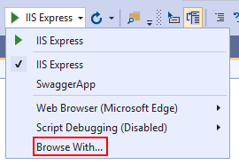
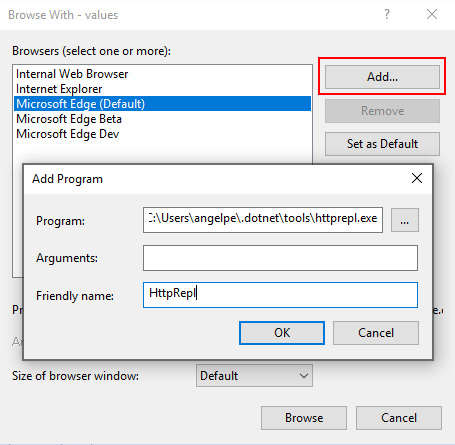
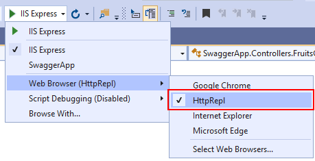

# overview
- HttpRepl (Read-Eval-Print-Loop) is a command line tool used to make HTTP requests to test web APIs and view their results.
- It can test web APIs hosted anywhere, including localhost and Azure App Service.
- Documentation: https://learn.microsoft.com/en-us/aspnet/core/web-api/http-repl/?view=aspnetcore-7.0&tabs=windows

# installation
```powershell
dotnet tool install -g Microsoft.dotnet-httprepl
```

# usage
## connecting to a web api
```powershell
httprepl ROOT_URI [--verbose]
```

Example:
```powershell
httprepl https://localhost:5001
```

Alternatively, after HttpRepl is running:
```powershell
> connect ROOT_URI
```

The above commands attempt to find the OpenAPI description automatically.  If it cannot be found, specify it:
```powershell
> connect ROOT_URI --openapi OPENAPI_DESCRIPTION_ADDRESS # like /swagger/v1/swagger.json
```

## navigating a web api
- View endpoints: `ls`
- Navigate to an endpoint: `cd ENDPOINT`
- Open Swagger UI page: `ui`

## making http requests
### configuring requests
Headers can be set before sending requests:
```powershell
> set header HEADER-NAME HEADER-VALUE
```

To unset a header, provide an empty `HEADER-VALUE`.

### get requests
Send a GET request once you are in an endpoint:  
```powershell
> get PARAMETER [OPTIONS]
```

Options:
- Set an HTTP request header: `--header HEADER=VALUE` or `HEADER:VALUE`
- Set the file where HTTP response body is written: `--response:body "C:\response.json"`
- Set the file where HTTP response headers are written: `--response:headers "C:\response.txt"`
- Stream the HTTP response: `--streaming`  

### post requests
Send a POST request:
```powershell
> post PARAMETER [OPTIONS] 
```

POST requests have the same options as GET requests, and also:
- Provide an inline HTTP request body: `--content {\"id\":2,\"name\":\"Cherry\"}"`
- Provide a path to a file containing the HTTP request body: `--file "C:\request.json"`
- Indicate that no HTTP request body is needed: `--no-body`
- <o>Note</o>: if none of the above 3 options are passed, HttpRepl opens the text editor for you to manually input the request body

### put requests
```powershell
> put PARAMETER [OPTIONS]
```

Options for PUT match those of POST.

### delete requests
```powershell
> delete PARAMETER [OPTIONS]
```

Options for DELETE match those of GET.

### patch requests
```powershell
> patch PARAMETER [OPTIONS]
```

Options for PATCH match those of POST.

### head requests
```powershell
> head PARAMETER [OPTIONS]
```

Options for HEAD match those of GET.

### options requests
```powershell
> options PARAMETER [OPTIONS]
```

Options for OPTIONS match those of GET.

## configuring httprepl
Once modified, preferences are stored in `%USERPROFILE%\.httpreplprefs`  
- View settings: `pref get`

### configuring output
- Set colors: `pref set colors.KEY=COLOR`
- Set indent space sizing: `pref set formatting.json.indentSize 4`
- Toggle request display (default=disabled): `echo on|off`

### configuring text editor
- Set default text editor: `pref set editor.command.default "C:\Program Files\Microsoft VS Code\code.exe"`
- Set command line arguments to launch text editor with: `pref set editor.command.default.arguments "--ARGUMENT-1 --ARGUMENT-2"`

### configuring openapi description search paths
- Set search paths: `pref set swagger.searchPaths "swagger/v2/swagger.json|swagger/v3/swagger.json"`
- Add one or more paths: `pref set swagger.addToSearchPaths "openapi/v2/openapi.json|openapi/v3/openapi.json"`
- Remove one or more paths: `pref set swagger.removeFromSearchPaths "swagger.json|/swagger.json"`

### configuration for secured endpoints
For default credentials (credentials of the user running the tool flow across to the endpoints being tested):
```powershell
> pref set httpClient.useDefaultCredentials true
> exit
httprepl
```

For default proxy credentials (credentials of the user running the tool flow to the proxy):
```powershell
> pref set httpClient.proxy.useDefaultCredentials true
> exit
httprepl
```

### scripts
Sets of HttpRepl commands can be stored in text files and run as a script:
`SomeScript.txt`
```
set base https://localhost:5001
ls
cd People
ls
get 1
```

Run the script:
```powershell
> run C:\SomeScript.txt
```

### configuring visual studio to run httprepl on f5
  
  

Select HttpRepl after adding it:  


### configuring visual studio code to run httprepl on debug
Create a launch configuration:
```json
"version": "0.2.0",
  "compounds": [
    {
      "name": ".NET Core REPL",
      "configurations": [
        ".NET Core Launch (web)",
        "httprepl"
      ]
    }
  ],
  "configurations": [
    {
      "name": "httprepl",
      "type": "coreclr",
      "request": "launch",
      "program": "dotnet",
      "args": ["httprepl", "http://localhost:5000"],
      "cwd": "${workspaceFolder}",
      "stopAtEntry": false,
      "console": "integratedTerminal"
    },
    {
      "name": ".NET Core Launch (web)",
      "type": "coreclr",
      "request": "launch",
      "preLaunchTask": "build",
      // If you have changed target frameworks, make sure to update the program path.
      "program": "${workspaceFolder}/bin/Debug/netcoreapp3.0/api.dll",
      "args": [],
      "cwd": "${workspaceFolder}",
      "stopAtEntry": false,
      // Enable launching a web browser when ASP.NET Core starts. For more information: https://aka.ms/VSCode-CS-LaunchJson-WebBrowser
      "serverReadyAction": {
        "action": "openExternally",
        "pattern": "^\\s*Now listening on:\\s+(https?://\\S+)"

      },
      "env": {
        "ASPNETCORE_ENVIRONMENT": "Development"
      },
      "sourceFileMap": {
        "/Views": "${workspaceFolder}/Views"
      }
    }
```

# telemetry
HttpRepl collects telemetry. Set `DOTNET_HTTPREPL_TELEMETRY_OPTOUT` to `1` or `true` to opt out.