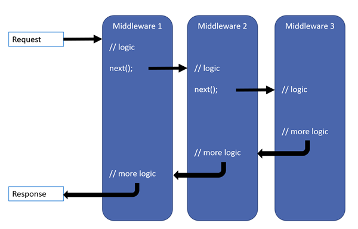

# Overview
Middleware is a pipeline of components to handle requests and responses.  Each component can:
- Pass the request to the next component;
- Perform work before and after the next component.  
  
(black arrows = thread of execution)

# Request Pipeline
Built with request delegates.  The delegates handle each HTTP request.
- Request delegates are configured with `Run`, `Map`, and `Use` extension methods:
	- `Use` extensions add to the pipeline.
	- `Map` extensions branch the pipeline.
	- `Run` extensions short-circuit the pipeline.
- Can be defined as in-line anonymous method or separate class.
- Each component performs operations on an `HttpContext` and either:  
  a. Invokes the next middleware in the pipeline, or;  
  b. Terminates the request.  

# Creating
```cs
var builder = WebApplication.CreateBuilder(args);
var app = builder.Build();

// Prefer the app.Use overload that requires passing a context to next: it saves two internal per-request allocations versus its other overload.
app.Use(async (context, next) => // Multiple request delegates are chained with Use
{
    // Do work that can write to the Response.
    await next.Invoke(); // The next parameter represents the next delegate in the pipeline. If next is not called, the pipeline is short-circuited.
    // Do logging or other work that doesn't write to the Response.
});

// Run delegates do not receive a next parameter.  The first Run delegate is always terminal.  Any Use or Run delegates added after this one are not called:
app.Run(async context =>
{
    await context.Response.WriteAsync("Hello from 2nd delegate.");
});

app.Run();
```

# Middleware Sequencing
For ASP.NET MVC & Razor Pages apps:  
  
If `app.UseRouting()` is not used, the Routing middleware runs at the beginning of the pipeline.  If used, it runs as per the above diagram.

The order that middleware components are added in `Program.cs` define the order in which they are invoked on requests and the reverse order for the response.  The order is critical. This is the recommended order:
```cs
var builder = WebApplication.CreateBuilder(args);

// Add services to the container.
var connectionString = builder.Configuration.GetConnectionString("DefaultConnection");
builder.Services.AddDbContext<ApplicationDbContext>(options => options.UseSqlServer(connectionString));
builder.Services.AddDatabaseDeveloperPageExceptionFilter();

builder.Services.AddDefaultIdentity<IdentityUser>(options => options.SignIn.RequireConfirmedAccount = true)
    .AddEntityFrameworkStores<ApplicationDbContext>();
builder.Services.AddRazorPages();

var app = builder.Build();

// Configure the HTTP request pipeline.
if (app.Environment.IsDevelopment())
{
    app.UseMigrationsEndPoint();
}
else
{
    app.UseExceptionHandler("/Error");
    app.UseHsts();
}

app.UseHttpsRedirection();
app.UseStaticFiles();
// app.UseCookiePolicy();

app.UseRouting();
// app.UseRequestLocalization();
// app.UseCors();

app.UseAuthentication();
app.UseAuthorization();
// app.UseSession();
// app.UseResponseCompression(); // Compress the response…
// app.UseResponseCaching(); // …and cache it to reduce CPU usage.
// app.UseStaticFiles(); // Since Compression is called earlier in the pipeline, static files are also compressed.

app.MapRazorPages();
app.MapControllerRoute(
    name: "default",
    pattern: "{controller=Home}/{action=Index}/{id?}");

app.Run();
```
# Other Middleware Components
These middleware extension methods are exposed on `WebApplicationBuilder`:
1. Exception/error handling:
    - When app runs in Development environment:
        - `UseDeveloperExceptionPage` — reports app runtime errors
        - `UseDatabaseErrorPage` — reports database runtime errors
    - When app runs in Production environment:
        - `UseExceptionHandler` — catches exceptions thrown in middlewares that follow it in the pipeline

2. `UseHsts` — Adds Strict-Transport-Security header.
3. `UseHttpsRedirection` — HTTP requests to HTTPS
4. `UseStaticFiles` — return static files and short-circuit further request processing
    a. Any files served are publicly available.
    b. The order of UseCors and UseStaticFiles depends on the app.
5. `UseCookiePolicy` — conforms app to EU GDPR regulations
6. `UseRouting` — to route requests
7. `UseAuthentication` — attempt to authenticate the user before they can access secure resources
8. `UseAuthorization` — authorize a user to access secure resources.
9. `UseSession` — establish and maintain session state (if used, call after cookie policy and before MVC middleware)
10. `UseEndpoints` with `MapRazorPages` — add Razor Pages endpoints to the request pipeline.

# Branching the Pipeline
Use `Map` extension method.  `Map` branches the pipeline based on matches of the given request path.  If the request path starts with the given path, the branch is executed:
```cs
var builder = WebApplication.CreateBuilder(args);
var app = builder.Build();

// Called if request starts with /map1:
app.Map("/map1", HandleMapTest1); 

// Called if request starts with /map2:
app.Map("/map2", HandleMapTest2); 

// Called if request starts with anything else:
app.Run(async context => { await context.Response.WriteAsync("Hello from non-Map delegate.")) };

app.Run();

static void HandleMapTest1(IApplicationBuilder app)
{
    app.Run(async context => { await context.Response.WriteAsync("Map Test 1")) };
}

static void HandleMapTest2(IApplicationBuilder app) 
{
    app.Run(async context => { await context.Response.WriteAsync("Map Test 2")) };
}
```
## [Notes on Map](https://learn.microsoft.com/en-us/aspnet/core/fundamentals/middleware/?view=aspnetcore-7.0#branch-the-middleware-pipeline)
- When `Map` is used, matched path segments are removed from `HttpRequest.Path` and append to `HttpRequest.PathBase` for each request.
- `Map` supports nesting.
- `Map` can match multiple segments at once.

## `MapWhen`
`MapWhen` branches the pipeline based on the result of a given predicate of type `Func<HttpContext, bool>`:
```cs
app.MapWhen(context => context.Request.Query.ContainsKey("branch"), HandleBranch);
```	
## `UseWhen`
`UseWhen` branches the pipeline based on the result of a given predicate of type `Func<HttpContext, bool>`.  The branch is rejoined to the main pipeline if:
- It does not short-circuit
- It does not contain terminal middleware
```cs
app.UseWhen(context => context.Request.Query.ContainsKey("branch"), appBuilder => HandleBranchAndRejoin(appBuilder));
```
