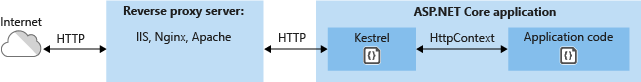

# Overview
ASP.NET on Windows ships with:
- Kestrel
- IIS HTTP Server (an in-process server for IIS)
- HTTP.sys

On IIS/Express:
- IIS HTTP Server—runs in same process as IIS worker process
- Kestrel—runs in separate process as IIS worker process

Documentation: https://learn.microsoft.com/en-us/aspnet/core/fundamentals/servers/?view=aspnetcore-7.0&tabs=windows

# Kestrel vs HTTP.sys
| Server | Performance | Cross-platform | Port and TLS configuration | Alternate transports | Port Sharing | Authentication | Fast proxying | Direct file transmission | Response caching |
|--------|-------------|----------------|----------------------------|----------------------|--------------|----------------|---------------|--------------------------|---------|
| Kestrel | Better | Yes | Yes | Yes | No | user-mode | No | No | No |
| HTTP.sys | Poorer | No | No | No | Yes | kernel-mode | Yes | Yes | Yes |

# Kestrel
Use Kestrel unless a feature that only HTTP.sys provides is required.
- Documentation: https://learn.microsoft.com/en-us/aspnet/core/fundamentals/servers/kestrel?view=aspnetcore-7.0

##  Use Cases
### Edge server  


### Reverse proxy  


# HTTP/2 Support
Both Kestrel and HTTP.sys require Windows 10/Server 2016 or later.
On Linux, Kestrel requires OpenSSL 1.0.2.

# HTTP/3 Support
<g>Availability: ASP.NET Core 7</g>  
These [notes on HTTP/3](../../../_net/web/http/httpclient#http3) apply.

HTTP/3 is not enabled by default.  To enable:  
`Program.cs`
```cs {hl_lines=[8,10]}
var builder = WebApplication.CreateBuilder(args);

builder.WebHost.ConfigureKestrel((context, options) =>
{
    options.ListenAnyIP(5001, listenOptions =>
    {
        // HTTP/3 should be configured with HTTP/1.1 and HTTP/2:
        listenOptions.Protocols = HttpProtocols.Http1AndHttp2AndHttp3;
        // HTTP/3 requires HTTPS:
        listenOptions.UseHttps();
    });
});
```

HTTP/3 is discovered as an available upgrade via the `alt-svc` header.  Kestrel automatically adds this header when HTTP/3 is enabled.

## Testing HTTP/3 with Localhost
Browsers do not allow self-signed certificates on HTTP/3 (like the Kestrel development certificate). To use `HttpClient` for localhost testing, follow the instructions in these [notes on HTTP/3](../../../_net/web/http/httpclient#http3) for configuring `HttpClient`.
