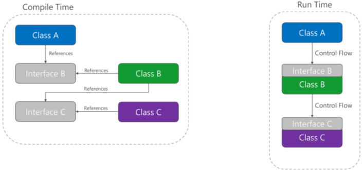

# Design Principles
[Principles | DevIQ](https://deviq.com/principles/principles-overview)
## Separation of concerns 
Software should be separated based on the kind of work it performs.
- The behavior responsible for choosing which items to format should be kept separate from the behavior responsible for formatting the items; these behaviors are only incidentally related to one another.

## Encapsulation
Parts of an application should be encapsulated (insulated) from other parts.
- App components and layers should be able to adjust their internal implementation without breaking their collaborators.
- In classes, encapsulation is achieved by limiting outside access to the class's internal state.
	- Outside actors should manipulate another class's internal state through well-defined functions (or property setters) vs modifying them directly.
- Data-driven architectures which rely on a central database for integration within and between apps are choosing to depend on the mutable global state represented by that database.
- Encapsulation helps achieve loose coupling.

## Dependency inversion
If class A calls a method of class B and class B calls a method of class C, then, at compile time, class A will depend on class B, and class B will depend on class C:  

Instead, class A can calls methods on an abstraction that B implements.  B depends on an interface controlled by A at compile time:

This inverts the dependency.  
Dependency inversion is what enables dependency injection.

## Explicit dependencies
Methods and classes should explicitly require any collaborating objects they need in order to function correctly.
- Class constructors exist to define "contract terms" with their clients, as in, "this class will only perform its promised function if all required dependencies (as constructor parameters) are fulfilled."

## Single responsibility
Objects should have only one responsibility and they should have only one reason to change.
- The only situation in which the object should change is if the manner in which it performs its one responsibility must be updated.
- Many kinds of new behavior are implemented as new classes instead of adding additional responsibility to existing classes.
- A given microservice should also have a single responsibility.

## Don't repeat yourself
Avoid specifying behavior related to a particular concept in multiple places.
- Just because two different constants have the same value does not mean you should only have one concept if they refer to two different things.  The constant, not its value, is the aforementioned "concept."

## Persistence ignorance
Types that need to be persisted but whose code is unaffected by the choice of persistence technology (like POCOs since they do not inherit from a base class or interface).

## Bounded contexts
[BoundedContext (martinfowler.com)](https://martinfowler.com/bliki/BoundedContext.html)
Modulizing an application.
- Each module represents a context that is separated from (bounded from) other contexts and each can evolve independently.
- Individual web applications should attempt to be their own bounded context:  they should have their own persistence store for their business model, rather than sharing a database with other apps.
- Communication between bounded contexts occurs through programmatic interfaces.
- Bounded contexts map closely to microservices.
