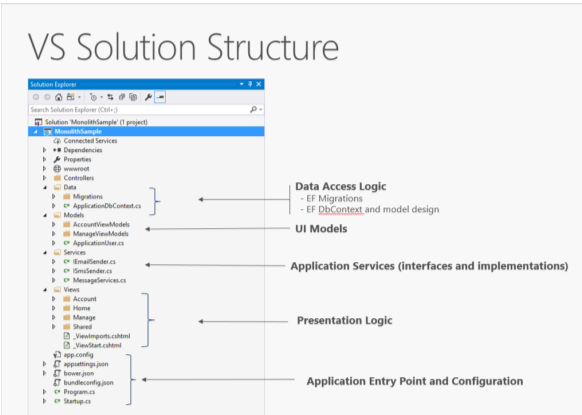
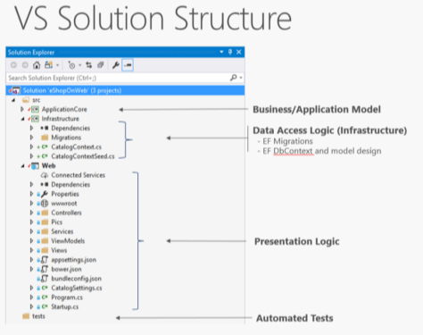
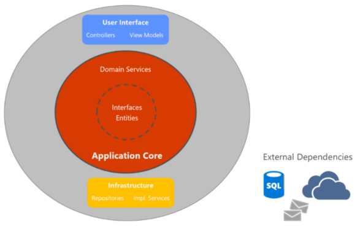
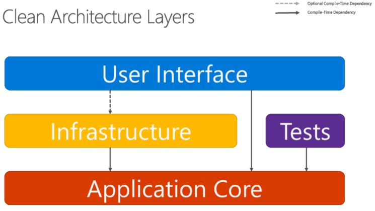
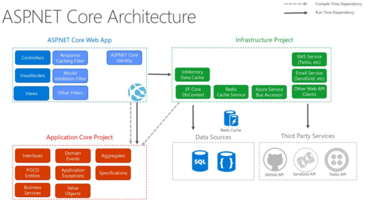

# Monolithic application
An entire application deployed as a single unit.
- When it needs to scale horizontally, the entire app is duplicated.
- Generally a single project compiled to a single assembly deployed as a single unit.

Organization of a Monolithic Application  

Separation of concerns is achieved through folders.

# "N-Layer" architecture apps
- Most common layers:
	- User Interface (UI)
	- Business Logic (BLL)
	- Data Access (DAL)
- Users make requests through the UI, which interacts only with the BLL.  The BLL calls for data from the DAL.  The UI should not make requests to the DAL directly. 
- Testing business logic in this architecture is difficult and requires a test database.

VS Solution for N-Layer App (3 projects):  

Even though it has 3 layers, it is still deployed as a single unit.

# Clean architecture (aka Onion architecture aka Hexagonal architecture aka …)
- [The Onion Architecture : part 1 | Programming with Palermo (jeffreypalermo.com)](https://jeffreypalermo.com/2008/07/the-onion-architecture-part-1/)
- [ardalis/CleanArchitecture: Clean Architecture Solution Template: A starting point for Clean Architecture with ASP.NET Core (github.com)](https://github.com/ardalis/cleanarchitecture)
- [Insights | 8th Light](https://www-origin.8thlight.com/insights)

In this architecture, infrastructure and implementation details depend on the Application Core.  
Achieved by definining abstractions (interfaces) in the App Core, which are then implemented by types defined in the Infrastructure layer:  
  

  

## Organizing Code in Clean Architecture
Application Core
- Entities (business model classes that are persisted)
- Aggregates (groups of entities)
- Interfaces—Data access, filesystem access, network calls, etc
- Domain Services
- Specifications
- Custom Exceptions and Guard Classes
- Domain Events and Handlers

## Infrastructure
- Data access implementations (like EF DbContext)
- Implementations of services that must interact with infrastructure concerns (`FileLogger`, `SmtpNotifier`, etc)
	- These services implement interfaces defined in App Core (so Infrastructure should reference App Core)

## UI Layer
- Entry point for the app
- References App Core
- Its types interact with Infrastructure strictly through interfaces defined in Application Core
- Includes Controllers, custom filters, middleware, views, viewmodels, startup
