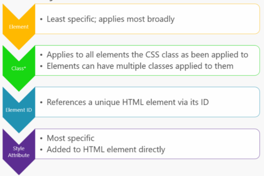

Complex web apps achieve separation of concerns by separating page content (HTML), layout and styling (CSS), and behavior (JavaScript).

# HTML
HTML elements represent formatted text, images, form inputs, and other structures.

# CSS
CSS controls the look and layout of HTML elements.
CSS styles can be applied to:  


## CSS preprocessors
CSS stylesheets do not support conditional logic, variables, or other programming language features.  
CSS preprocessors (like Sass (Ruby-based) and LESS (JavaScript-based)) add this support.  
A plain CSS file is valid Sass or LESS.

# JavaScript
Can be defined as attributes within HTML elements, blocks of script within a page, or in separate files.

## jQuery
Working with JavaScript generally requires:
1. Selecting an HTML element and reading/writing its value
2. Querying a Web API for data
3. Sending a command to a Web API
4. Performing validation

jQuery and other libraries simplify this process.  
jQuery works at the DOM level and only has an imperative model (ie: an event handler with code that inspect a textbox's value and sets the visibility of the target element based on that value).  Data binding (which is declarative) generally achieves these tasks with less code.

## Angular SPAs
Angular 2 is built with TypeScript.  Offers a full MVC pattern implementation.

Angular applications are built with Components:
```js
import { Component } from '@angular/core'; 

@Component({ 
	selector: 'my-app', // The id of the element where this component is used
	template: `<h1>Hello {{name}}</h1>` // name is a placeholder
})

export class AppComponent { name = 'Angular'; } // The name of the component
```

eShopOnContainers includes an Angular SPA implementation; Angular is used to manage the store's shopping basket, load and display items from its catalog, and handle order creation.

## React
Only concerned with Views. Not a framework—just a library.  
Uses a virtual DOM (advantages:  performance (virtual DOM optimizes which parts of actual DOM need to be updated), testability (no need to have a browser)).  
Adds HTML directly within its JavaScript code as JSX:
```jsx
<ul> 
{ 
	authors.map(author => 
		<li key={author.id}>{author.name}</li>
)}
</ul>
```

## Vue
A progressive framework for building user interfaces.  Core library focuses on View layer only.

# Blazor WASM
A SPA framework for building interactive client-side web apps with .NET.  
Uses open web standards, not plugins or recompiling code to other languages.

WASM is a compact bytecode format optimized for fast download and execution speed.  
WASM has JavaScript interop.
