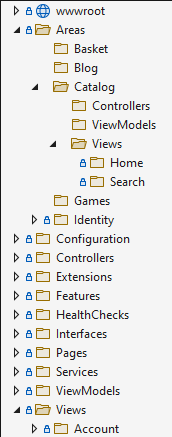
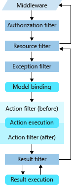

Monolithic web apps have a single entry point in the Web project.

Projects
1. ApplicationCore   
    a. Contains object model, interfaces  
    b. References as few dependencies as possible  
    c. Referenced by other projects in this solution  
2. Infrastructure  
    a. Contains implementation details (how persistence is performed; how notifications are sent)  
    b. Implements interfaces defined in ApplicationCore  
    c. References implementation-specific packages (like EF Core) but does not expose details of those implementations outside of the project  
3. UI  
    a. Contains UI level concerns (but not business logic or infrastructure details)  
    b. Ideally, no dependency on Infrastructure, but this requires 3rd party DI container  

# Organizing by Feature
[Vertical Slices | DevIQ](https://deviq.com/practices/vertical-slices) | [ASP.NET Core - Feature Slices for ASP.NET Core MVC | Microsoft Learn](https://learn.microsoft.com/en-us/archive/msdn-magazine/2016/september/asp-net-core-feature-slices-for-asp-net-core-mvc)

ASP.NET Core MVC applications can be organized by feature instead of by file type by using Areas.  


Areas work by:  
1. Decorating controllers with the name of their respective area:
    ```cs
	[Area("Catalog")]
	public class HomeController
	{}
    ```
2. Adding area support to routes:
    ```cs
	app.UseEndpoints(endpoints =>
	{
	    endpoints.MapControllerRoute(name: "areaRoute", pattern: "{area:exists}/{controller=Home}/{action=Index}/{id?}");
	    endpoints.MapControllerRoute(name: "default", pattern: "{controller=Home}/{action=Index}/{id?}");
    });
    ```

Instead of Areas, features can also be organized through a custom folder structure you create.  To support this, you might create a convention that automatically gets the feature name for a given controller based on its namespace:
```cs
public class FeatureConvention : IControllerModelConvention
{
    public void Apply(ControllerModel controller)
    {
        controller.Properties.Add("feature",
        GetFeatureName(controller.ControllerType));
    }

    private string GetFeatureName(TypeInfo controllerType)
    {
        string[] tokens = controllerType.FullName.Split('.');
        if (!tokens.Any(t => t == "Features")) return "";
        string featureName = tokens
            .SkipWhile(t => !t.Equals("features", StringComparison.CurrentCultureIgnoreCase))
            .Skip(1)
            .Take(1)
            .FirstOrDefault();
        return featureName;
    }
}
```

You then specify the convention as an option when you add support for MVC to the app:
```cs
// ConfigureServices
services.AddMvc(o => o.Conventions.Add(new FeatureConvention()));

// Program.cs
builder.Services.AddMvc(o => o.Conventions.Add(new FeatureConvention()));
```

# Organizing APIs and Blazor Apps
APIs that need to be secured should be in a separate project from the View or Razor Pages app.  They have unique deployment and load characteristics.

Blazor apps should also be separate projects.  They have different runtime characteristics and security models.  If they share common types with the server-side web app (or API project), these should be defined in a common shared project.

In eShopOnWeb, adding a Blazor WASM admin interface added several new projects:
- BlazorAdmin — the Blazor WASM project itself
- PublicApi — A new set of public API endpoints used by BlazorAdmin
- BlazorShared — certain shared types used by both

Organizing Cross-Cutting Concerns
Authentication, model validation rules, output caching and error handling are all examples of cross-cutting concerns.

## Filters
Use [filters](https://learn.microsoft.com/en-us/aspnet/core/mvc/controllers/filters) to run code before or after certain steps in the request processing pipeline:  


Filters can also eliminate duplication in error handling policies for APIs.  
Instead of validating a model manually and returning BadRequest is validation fails...  
```cs
[HttpPut("{id}")]
public async Task<IActionResult> Put(int id, [FromBody]Author author)
{
    if ((await _authorRepository.ListAsync()).All(a => a.Id != id))
    {
        return NotFound(id);
    }
    if (!ModelState.IsValid)
    {
        return BadRequest(ModelState);
    }
    author.Id = id;
    await _authorRepository.UpdateAsync(author);
    return Ok();
}
```

...You can define the policy as an attribute:  
```cs
public class ValidateModelAttribute : ActionFilterAttribute
{
    public override void OnActionExecuting(ActionExecutingContext context)
    {
        if (!context.ModelState.IsValid)
        {
            context.Result = new BadRequestObjectResult(context.ModelState);
        }
    }
}
```
You can add ValidateModelAttribute to your project from [Ardalis.ValidateModel (nuget.org)](https://www.nuget.org/packages/Ardalis.ValidateModel)

See also: [Real-World ASP.NET Core MVC Filters (microsoft.com)](https://learn.microsoft.com/en-us/archive/msdn-magazine/2016/august/asp-net-core-real-world-asp-net-core-mvc-filters)

