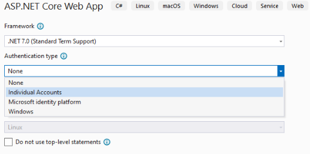
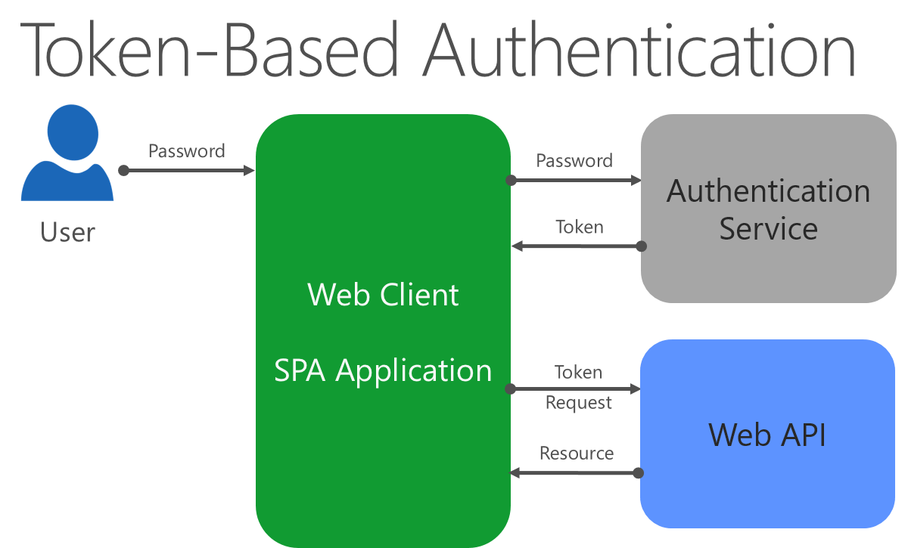

Ensure SSL is used by the application: https://learn.microsoft.com/en-us/aspnet/core/security/enforcing-ssl

# Identity
ASP.NET Core Identity (built in) has support for local user accounts and external identity providers.
(An external option is [Identity Server (github.com)(https://github.com/IdentityServer/IdentityServer4)])

ASP.NET Core Identity is included in projects if Individual Accounts is selected.  



## Configuring Identity
### In `Program.cs`
```cs
var builder = WebApplication.CreateBuilder(args);

// Add services to the container.
var connectionString = builder.Configuration.GetConnectionString("DefaultConnection");
builder.Services.AddDbContext<ApplicationDbContext>(options =>
    options.UseSqlServer(connectionString));

builder.Services.AddDatabaseDeveloperPageExceptionFilter();

builder.Services.AddDefaultIdentity<IdentityUser>(options => options.SignIn.RequireConfirmedAccount = true)
    .AddEntityFrameworkStores<ApplicationDbContext>();

builder.Services.AddRazorPages();

var app = builder.Build();

// Configure the HTTP request pipeline.
if (app.Environment.IsDevelopment())
{
    app.UseMigrationsEndPoint();
}
else
{
  app.UseExceptionHandler("/Error");
  // The default HSTS value is 30 days. You may want to change this for production scenarios, see https://aka.ms/aspnetcore-hsts.
  app.UseHsts();
}

app.UseHttpsRedirection();
app.UseStaticFiles();

app.UseRouting();

app.UseAuthentication();
app.UseAuthorization();

app.MapRazorPages();

app.Run();
```

### In app startup
```cs
// Add framework services.
builder.Services.AddDbContext<ApplicationDbContext>(options =>
    options.UseSqlServer(Configuration.GetConnectionString("DefaultConnection")));
builder.Services.AddIdentity<ApplicationUser, IdentityRole>()
    .AddEntityFrameworkStores<ApplicationDbContext>()
    .AddDefaultTokenProviders();
builder.Services.AddMvc();

var app = builder.Build();

if (app.Environment.IsDevelopment())
{
    app.UseMigrationsEndPoint();
}
else
{
    app.UseExceptionHandler("/Error");
    app.UseHsts();
}

app.UseHttpsRedirection();
app.UseStaticFiles();

app.UseRouting();

app.UseAuthentication();
app.UseAuthorization();

app.MapRazorPages();
```

# Authentication
Schemes are techniques for performing authentication in web applications.  `DefaultAuthenticateScheme` is configured to provide a default scheme.

Calling `AddIdentity<TUser, TRole>` also includes this call to configure the authentication scheme for a web app with user interaction:
```cs
builder.Services.AddAuthentication(options =>
{
    options.DefaultAuthenticateScheme = IdentityConstants.ApplicationScheme;
    options.DefaultChallengeScheme = IdentityConstants.ApplicationScheme;
    options.DefaultSignInScheme = IdentityConstants.ExternalScheme;
});
```
The above schemes use cookies for persistence and redirection to login pages for authentication by default.

For a web API, configure authentication like this:
```cs
builder.Services  
.AddAuthentication(config => { config.DefaultScheme = JwtBearerDefaults.AuthenticationScheme; })
.AddJwtBearer(config =>
{
    config.RequireHttpsMetadata = false;
    config.SaveToken = true;
    config.TokenValidationParameters = new TokenValidationParameters
    {
        ValidateIssuerSigningKey = true,
        IssuerSigningKey = new SymmetricSecurityKey(key),
        ValidateIssuer = false,
        ValidateAudience = false
    };
});
```

## Authentication in Blazor Apps
Blazor Server apps can use the same features as above.  
Blazor WASM apps cannot use built-in Identity and Authentication providers since they run in a browser.  They store user authentication status locally and access claims to determine authorization.  All A&A checks should be performed on the server regardless of any logic implemented by the WASM app.

# Authorization
The Authorize attribute, along with roles, can be used:
```cs
[Authorize(Roles = "HRManager,Finance")] // This means either HRManager OR Finance.  For AND, apply each role on individua lines.
public class SalaryController : Controller
{

}
```
Or, apply authorization policies instead of roles:
```cs
[Authorize(Policy = "CanViewPrivateReport")]
public IActionResult ExecutiveSalaryReport()
{
    return View();
}
```

## Claims
Name-value pairs that represent properties of an authenticated user.  Used as part of authorization policies:
```cs
public void ConfigureServices(IServiceCollection services)
{
    services.AddMvc();
    services.AddAuthorization(options =>
    {
        options.AddPolicy(
			"EmployeeOnly", // name of policy
			policy => policy.RequireClaim("EmployeeNumber")); // requires existence of this claim
    });
}
```

This policy would then be used in Authorize attribute.

## Securing web APIs  


Web APIs used token-based authentication.
The most common form is JSON Web Token (JWT or "jot").
Process:
1. Client authenticates with auth provider.
2. If successful, client is issued a token.
3. Client adds token as header on requests to the API.

Auth providers can be Azure AD, OAuth, or custom implementations like [IdentityServer](https://github.com/IdentityServer).

JWT tokens can embed claims about a user.  These can be read via tools like [jwt.io](https://jwt.io/).

