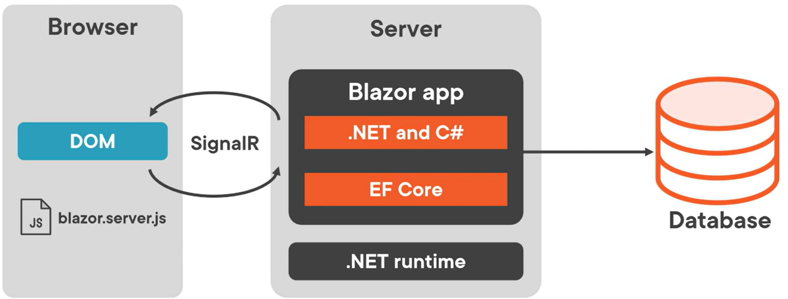

# Overview
Regardless of the hosting model chosen, the way Razor components are built is the same.  The same Razor components can be used with any of the hosting models, unchanged.

# Blazor Server
Hosts Razor components on the server in an ASP.NET Core app.
- UI updates are handled via a SignalR connection using WebSockets protocol
- The state on the server with each associated client is called a circuit
  - Circuits can tolerate temporary network interruptions
  - If the app is opened in multiple tabs, each tab is a separate circuit
  - Circuits are terminated gracefully by closing a browser tab or navigating to an external URL
  - Interrupted circuits are maintained for a configurable amount of time
- The runtime stays on the server:
  - The runtime executes the C# code; sends UI requests from the browser to the server; applies UI updates to a rendered component that are sent back to the browser
- The client runs the Blazor script (blazor.server.js) and establishes the SignalR connection with the server

## Content Rendering in Blazor Server vs. Other ASP.NET Core Apps (with Razor views or Razor Pages)
- When a Razor Page or view is rendered, each line of Razor code is parsed to HTML and the new HTML page is sent to the client (the server disposes of the Page or view instance).
- Blazor Server produces a graph of components similar to an HTML or XML DOM.  This includes state.  Blazor evaluates the component graph, produces a binary representation of it, and sends it to the client for rendering.
  - After a client-server connection is established, the component's static, pre-rendered elements are replaced with dynamic elements.
  - Once the elements are dynamic, UI updates are triggered by user interaction and app events.
  - When an update is triggered, Blazor re-renders the component graph and sends a diff to the client in binary format.

Pros:
- Full .NET API available
- Significantly smaller download size than Blazor WASM
- Faster startup vs. Blazor WASM
- .NET debugging works as normal
- Works on resource-constrained devices and devices that don't support WASM
- App's code base is not shared with clients  

Cons:
- Higher latency (every interaction requires a network hop)
- No offline support; if client connection fails, app stops working
- Scaling apps requires more instances
- ASP.NET Core web server is required to serve the app; no CDN support

# Blazor WASM
A SPA framework for interactive, client-side web apps.
- Blazor WASM works by:
  - Compiling C# code files and Razor files into assemblies
  - Sending the assemblies and the .NET runtime to the browser
  - Bootstrapping the .NET runtime to load the assemblies for the app
  - Using JavaScript interop to handle DOM manipulation and browser API calls
- App is executed directly in browser UI thread
- UI updates and event handling occur in the same process
- The client runs blazor.webassembly.js script to download the runtime, the app, and its dependencies, and to initialize the runtime

## Standalone Blazor WASM app
A Blazor WASM app is an app that is embedded in a website. It can be deployed without a backend ASP.NET Core App to serve its files. In this scenario, it might be deployed via CDN instead of on a website (HTML, Drupal, etc).

## Hosted Blazor WASM app
Includes an ASP.NET Core backend.

Blazor WASM supports AOT (.NET code compiled directly into WASM).  This results in faster runtime performance but larger app size.

Pros:
- App remains functional if client drops connection
- Work is offloaded from server to client
- Supports CDN (does not require ASP.NET Core web server)

Cons:
- Only a subset of .NET APIs available
- Client must support WASM
- Cannot access server-side resources (like a database) directly; requires an API on the server that the WASM client accesses
- Signficantly larger download size than Blazor Server
- Slower startup vs. Blazor Server

# Blazor Hybrid
- Runs as a native app on the client
- Razor components run in the native app (not WASM) and render web UI based on HTML/CSS to an embedded Web View control through a local interop channel
- No WASM
- Must be built with .NET MAUI, WPF, and WinForms (by using BlazorWebView controls)

Pros:
- Full .NET API available
- Reuse of existing components that can be shared across mobile, desktop and web
- Apps have full access to native capabilities of device

Cons:
- Separate native clients must be built, deployed, and maintained fore ach target platform
- Native client apps usually take longer to find, download, and install vs. access an app in the browser

# Comparison Table
| Consideration | Server | WASM | Hybrid |
|---------------|--------|------|--------|
Full .NET API compatibility | Yes | No (subset) | Yes
Access to server resources like a database | Yes | No | No
Native execution speed | Slowest | Balanced | Fastest
App code stays on server | Yes | No | No
Run apps offline once downloaded | No | Yes (if PWA) | Yes
Supports static site hosting & CDN | No | Yes | No
Scales to many concurrent users | No | Yes | Yes
Full access to native client capabilities | No | No | Yes
Requires an installer | No | No | Yes
