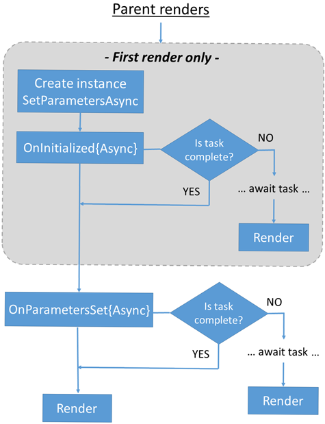

# Overview
Component lifecycle events are processed in a set of lifecycle methods.  These methods can be overridden to perform additional operations in Components during Component initialization and rendering.

- The Component lifecycle events in these notes operate separately from [Blazor Server's reconnection event handlers](https://learn.microsoft.com/en-us/aspnet/core/blazor/fundamentals/signalr?view=aspnetcore-7.0#reflect-the-connection-state-in-the-ui-blazor-server).
- Documentation: https://learn.microsoft.com/en-us/aspnet/core/blazor/components/lifecycle?view=aspnetcore-7.0

## General lifecycle
- Only the first render:
  - Create component's instance
  - Run `SetParametersAsync`
  - Call `OnInitialized{Async}`
- Every time:
  - Call `OnParametersSet{Async}`
  - Render  



# [SetParametersAsync()](https://learn.microsoft.com/en-us/aspnet/core/blazor/components/lifecycle?view=aspnetcore-7.0#when-parameters-are-set-setparametersasync)
Sets the value of each property with the `[Parameter]` or `[CascadingParameter]` attribute that has a corresponding value in the `ParameterView`.  `ParameterView` contains the component parameter values for the Component

This method can be overridden to interact directly with `ParameterView`'s parameters.  In such an override, if `base.SetParametersAsync` is not invoked, properties with a `[Parameter]` or `[CascadingParameter]` attribute will not be populated unless done manually. 

# OnInitialized{Async}()
Invoked when the Component is initialized after having received its initial parameters in `SetParametersAsync`.

If `OnInitialized()` is overridden, component initialization will be synchronous, and parent initialization is guaranteed to complete before child component initialization.

## Prerendering consideration
Blazor apps that prerender their content on the server call `OnInitializedAsync` *twice*:
* Once when Component is initially rendered statically
* A second time when the browser renders the Component

This can be prevented with [stateful reconnection after prerendering](#stateful-reconnection-after-prerendering).

# OnParametersSet{Async}()
Invoked:
* After the Component is initialized in `OnInitialized{Async}`
* When the parent Component renders and supplies:
  * Immutable types and at least one parameter has changed
  * Complex-typed parameters

# OnAfterRender{Async}()
Invoked after a Component has finished rendering.  JS interop calls should happen at this stage.

`OnAfterRender{Async}()` contains a `firstRender` parameter that is set to `true` the first time the Component instance is rendered:
```cs
protected override void OnAfterRender(bool firstRender)
{
    if (firstRender) 
    {
        //...
    }
}
```

## Prerendering consideration
`OnAfterRender{Async}()` is *not* called during the prerendering process on the server.

# StateHasChanged()
`StateHasChanged()` is called to notify the Component that its state has changed.  When applicable, calling this method can cause the Component to be rerendered. 
This is necessary when the Component updates due to an external change (like an event from a service). In these cases, the Component does not update automatically.

`StateHasChanged()` is called automatically for `EventCallback` methods.

<o>StateHasChanged has some important considerations</o>. See [here](../statehaschanged-considerations/).

# Handle Incomplete Async Actions at Render
Async actions performed in lifecycle events may not have completed before the Component is rendered.  Provide rendering logic to confirm that objects are initialized.  Render placeholder UI elements (like a "loading" message) while the objects are `null`.

See the `FetchData` component in the Blazor default template for an example.

# Stateful Reconnection After Prerendering
See: https://learn.microsoft.com/en-us/aspnet/core/blazor/components/lifecycle?view=aspnetcore-7.0#stateful-reconnection-after-prerendering

# Prerendering with JavaScript Interop
See: https://learn.microsoft.com/en-us/aspnet/core/blazor/components/lifecycle?view=aspnetcore-7.0#prerendering-with-javascript-interop

# [Component Disposal](https://learn.microsoft.com/en-us/aspnet/core/blazor/components/lifecycle?view=aspnetcore-7.0#component-disposal-with-idisposable-and-iasyncdisposable)
If a Component implements `IDisposable`, `IAsyncDisposable`, or both, the framework calls for unmanaged resource disposal when the Component is removed from the UI.

<o>Note</o>: `StateHasChanged` cannot be called in `Dispose` methods.  This is not supported.  

<o>Note</o>: Alaways unsubscribe event handlers from .NET events during disposal.

## Synchronous Disposal
Use `IDisposable.Dispose`:
```html
@implements IDisposable
<!-- ... -->
```
```cs
@code {
 // ...
  protected override void OnInitialized()
  {
    editContext = new(model);
    editContext.OnFieldChanged += HandleFieldChanged;
  }
  private void HandleFieldChanged(object sender, FieldChangedEventArgs e)
  {
    // ...
  }
  public void Dispose()
  {
    editContext.OnFieldChanged -= HandleFieldChanged;
  }
}
```

<o>Note</o>: If the object is created in a lifecycle method (ie: `OnInitialized{Async}`), check for `null` before calling `Dispose`.

## Asynchronous Disposal
Use `IAsyncDiposable.DisposeAsync`:
```html
@implements IAsyncDisposable
<!--  -->
```
```cs
@code {
// ...
public async ValueTask DisposeAsync()
{
  if (obj is not null)
  {
    await obj.DisposeAsync();
  }
}
```

# Cancelable Background Work
Background asynchronous operations do not automatically stop when a user navigates away from a Component.

To implement canceleable background work in a Component:
  1. Use a `CancellationTokenSource` and `CancellationToken`.
1. On disposal, and at any point when the token is manually canceled, call `CancellationTokenSource.Cancel` to signal that the background work should be canceled.
2. After the call to Cancel returns, call `ThrowIfCancellationRequested` on the token.

See: https://learn.microsoft.com/en-us/aspnet/core/blazor/components/lifecycle?view=aspnetcore-7.0#cancelable-background-work
