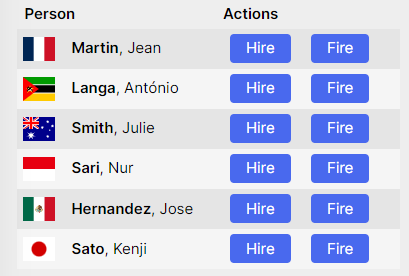
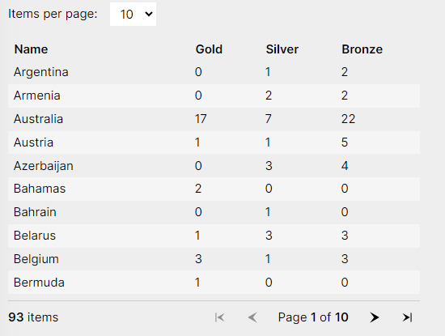

# Overview
<o>Availability: ASP.NET Core 7 (Preview)</o>  
`QuickGrid` is an experimental Component for quickly displaying data in tabular form.  It is highly optimized.

`QuickGrid` is in preview in ASP.NET Core 7 and not officially supported until ASP.NET Core 8 or later.

`QuickGrid` sample site: https://aspnet.github.io/quickgridsamples/

# Installing
```posh
dotnet add package microsoft.aspnetcore.components.quickgrid --prerelease
```

# Using
```html
@page "/quickgrid-example"
@using Microsoft.AspNetCore.Components.QuickGrid

<QuickGrid Items="@people">
    <PropertyColumn Property="@(p => p.PersonId)" Sortable="true" />
    <PropertyColumn Property="@(p => p.Name)" Sortable="true" />
    <PropertyColumn Property="@(p => p.PromotionDate)" Format="yyyy-MM-dd" Sortable="true" />
</QuickGrid>
```
```cs
@code {
    private record Person(int PersonId, string Name, DateOnly PromotionDate);

    private IQueryable<Person> people = new[]
    {
        new Person(10895, "Jean Martin", new DateOnly(1985, 3, 16)),
        new Person(10944, "António Langa", new DateOnly(1991, 12, 1)),
        new Person(11203, "Julie Smith", new DateOnly(1958, 10, 10)),
        new Person(11205, "Nur Sari", new DateOnly(1922, 4, 27)),
        new Person(11898, "Jose Hernandez", new DateOnly(2011, 5, 3)),
        new Person(12130, "Kenji Sato", new DateOnly(2004, 1, 9)),
    }.AsQueryable();
}
```  
  
# Data Sources
`QuickGrid` supports:
1. In-memory `IQueryable`
2. EF Core `IQueryable`
3. Remote data (like from a JSON API)

## EF Core `IQueryable`
Performs sorting/filter/etc inside the database.  Using an EF Core data source requires additional configuration:

1. Add the Entity Framework adapter:  
    ```powershell
    dotnet add package microsoft.aspnetcore.components.quickgrid.entityframeworkadapter --prerelease
    ```
    `Program.cs`
    ```cs
    using Microsoft.AspNetCore.Components.QuickGrid.EntityFrameworkAdapter;
    // ...
    builder.Services.AddQuickGridEntityFrameworkAdapter();
    // ...
    ```

3. Supply the EF's `DataContext`'s `DbSet` property as `QuickGrid`'s `Items` parameter:  
    `SomeComponent.razor`
    ```html
    @inject ApplicationDbContext MyDbContext

    <QuickGrid Items="@MyDbContext.People">
        ...
    </QuickGrid>
    ```

    Or, filter the data before passing it:  
    ```html
    @inject ApplicationDbContext MyDbContext

    <QuickGrid Items="@MyDbContext.Documents.Where(d => d.CategoryId == currentCategoryId)">
        ...
    </QuickGrid>
    ```

# Columns
QuickGrid has two built-in column types:  PropertyColumn and TemplateColumn.  Use ColumnBase to create your own column types.

## `PropertyColumn`
- Displays a single value specified by the `Property` parameter
- Sorts automatically via `Sortable="true"`
- Uses the property's name as title if not otherwise set
- Use the `Format` parameter and provide a format string to control how the value is displayed

```html
@inject DataSource Data

<div class="grid">
    <QuickGrid Items="@Data.People">
        <PropertyColumn Property="@(c => c.PersonId)" Sortable="true"  />
        <PropertyColumn Property="@(c => c.FirstName)" Sortable="true" />
        <PropertyColumn Property="@(c => c.LastName)" Sortable="true" />

        <!-- Example with a format string -->
        <PropertyColumn Property="@(c => c.BirthDate)" Format="yyyy-MM-dd" Sortable="true" />

        <!-- Example of a computed expression -->
        <PropertyColumn Title="Age in years" Property="@(c => ComputeAge(c.BirthDate))" Sortable="true" Align="Align.Right" />
    </QuickGrid>
</div>
```
```cs
@code {
    int ComputeAge(DateOnly birthDate)
        => DateTime.Now.Year - birthDate.Year - (birthDate.DayOfYear < DateTime.Now.DayOfYear ? 0 : 1);
}
```  


## `TemplateColumn`
- Uses Razor fragments for the content of its cells
- Cannot sort automatically; supply a value to `SortBy` parameter
- Cannot title columns automatically
- Use `TemplateColumn` to add Blazor Components to cells

```html
@inject DataSource Data

<div>
    <QuickGrid Items="@Data.People">
        <TemplateColumn Title="Person" SortBy="@sortByName">
            <div class="flex items-center">
                
                <nobr>
                    <strong>@context.LastName</strong>, @context.FirstName
                </nobr>
            </div>
        </TemplateColumn>
        <TemplateColumn Title="Actions">
            <button @onclick="@(() => Hire(context))">Hire</button>
            <button @onclick="@(() => Fire(context))">Fire</button>
        </TemplateColumn>
    </QuickGrid>
</div>

<p><strong>@message</strong></p>
```
```cs
@code {
    string message = string.Empty;

    GridSort<Person> sortByName = GridSort<Person>
        .ByAscending(p => p.LastName)
        .ThenAscending(p => p.FirstName);

    void Hire(Person p) => message = $"You want to hire {p.FirstName} {p.LastName}";

    void Fire(Person p) => message = $"You want to fire {p.FirstName} {p.LastName}";
}
```
<details><summary>CSS</summary>
<p>

```css
/* Stripe effect */
::deep tbody tr { background-color: rgba(0,0,0,0.04); }
::deep tbody tr:nth-child(even) { background: rgba(255,255,255,0.4); }

/* Button styles*/
button {
    background: #4969ee;
    color: white;
    padding: 0.2rem 1rem;
    border-radius: 0.25rem;
    margin: 0.25rem 0.5rem;
}
button:hover { background-color: #6884f9; }
button:active { background-color: #192e86; }
```  

</p>  
</details>  



## Standard Column Parameters
- `Title` — set the column title. Not applicable if you're using `HeaderTemplate`.
- `Class` — set a CSS class name on the header and body cells for this column.
- `Align` — align the column left/center/right.
- `HeaderTemplate` — supply a Razor fragment that completely replaces the default header cell contents. If you use this, it's your responsibility to render any sort indicators you may want, and to call the grid's `SortByColumnAsync` if the header is clicked.
- `ColumnOptions` — supply a Razor fragment that will appear in a popover if a "column options" button is clicked.
- `Sortable` — indicate whether the grid should be sortable by this column. The default value varies based on the column type and other column-specific options.
- `IsDefaultSortColumn` — indicate that the grid should be sorted by this column by default.
- `InitialSortDirection` — indicate the default sort direction.
- `PlaceholderTemplate` — supply a Razor fragment that will be used while the data load is pending. This is only applicable for virtualized grids.

## Sorting
- Sort a `PropertyColumn` with `Sortable="true"`
- Sort a `Templatecolumn` by supplying a value to the `SortBy` parameter
- Specify the `InitialSortDirection` on a column with `SortDirection.Ascending` or `Descending`

### Sorting with Remote Data (ItemsProvider)
If using an ItemsProvider callback, use the request parameter to access the current sort order:
```cs
request.GetSortByProperties()
```  
<o>Note: This method may throw an exception if the current sort order is *not* expressible as a chain of column names such as an a PropertyColumn with `Property="@(x => x.Width * x.Length)"`.</o>  

## Filtering
For in-memory or EF Core data, use .NET's standard LINQ methods to apply filtering rules before passing data to the grid's `Items` parameter:  
```html
@inject DataSource Data

<div class="grid">
    <QuickGrid Items="@FilteredCountries" Pagination="@pagination">
        <PropertyColumn Property="@(c => c.Name)" Sortable="true" Class="country-name">
            <ColumnOptions>
                <div class="search-box">
                    <input type="search" autofocus @bind="nameFilter" @bind:event="oninput" placeholder="Country name..." />
                </div>
            </ColumnOptions>
        </PropertyColumn>
        <PropertyColumn Property="@(c => c.Medals.Gold)" Sortable="true" Align="Align.Right" />
        <PropertyColumn Property="@(c => c.Medals.Silver)" Sortable="true" Align="Align.Right" />
        <PropertyColumn Property="@(c => c.Medals.Bronze)" Sortable="true" Align="Align.Right" />
        <PropertyColumn Property="@(c => c.Medals.Total)" Sortable="true" Align="Align.Right">
            <ColumnOptions>
                <p>Min: <input type="range" @bind="minMedals" @bind:event="oninput" min="0" max="150" /> 
                <span class="inline-block w-10">@minMedals</span></p>
                <p>Max: <input type="range" @bind="maxMedals" @bind:event="oninput" min="0" max="120" /> 
                <span class="inline-block w-10">@maxMedals</span></p>
            </ColumnOptions>
        </PropertyColumn>
    </QuickGrid>
</div>
<Paginator State="@pagination" />
```
```cs
@code {
    PaginationState pagination = new PaginationState { ItemsPerPage = 10 };
    IQueryable<Country>? itemsQueryable;
    string nameFilter;
    int minMedals;
    int maxMedals = 120;

    IQueryable<Country> FilteredCountries
    {
        get
        {
            var result = itemsQueryable?.Where(c => c.Medals.Total <= maxMedals);

            if (!string.IsNullOrEmpty(nameFilter))
                result = result.Where(c => c.Name.Contains(nameFilter, StringComparison.CurrentCultureIgnoreCase));

            if (minMedals > 0)
                result = result.Where(c => c.Medals.Total >= minMedals);

            return result;
        }
    }

    protected override async Task OnInitializedAsync()
    {
        itemsQueryable = (await Data.GetCountriesAsync()).AsQueryable();
    }
}
```
<details><summary>CSS</summary>
<p>

```css
::deep table { min-width: 100%; }
::deep th.country-name { width: 14rem; }

/* Subtle stripe effect */
::deep tr:nth-child(even) {
    background: rgba(255,255,255,0.4);
}

/* Don't collapse rows even if they are empty */
::deep tbody tr { height: 1.8rem; }
```

</p>
</details>


 ## Paging
 Construct an instance of `PaginationState` and pass it as the grid's `Pagination` property. To provide a UI for pagination, you can either use the built-in `Paginator` component, or create a custom UI that reads and modifies the `PaginationState` instance:  
 ```html
 @inject DataSource Data

<div class="page-size-chooser">
    Items per page:
    <select @bind="@pagination.ItemsPerPage">
        <option>5</option>
        <option>10</option>
        <option>20</option>
        <option>50</option>
    </select>
</div>

<div class="grid">
    <QuickGrid Items="@itemsQueryable" Pagination="@pagination">
        <PropertyColumn Property="@(c => c.Name)" Sortable="true" Class="country-name" />
        <PropertyColumn Property="@(c => c.Medals.Gold)" Sortable="true" Align="Align.Right" />
        <PropertyColumn Property="@(c => c.Medals.Silver)" Sortable="true" Align="Align.Right" />
        <PropertyColumn Property="@(c => c.Medals.Bronze)" Sortable="true" Align="Align.Right" />
    </QuickGrid>
</div>

<Paginator State="@pagination" />
```
```cs
@code {
    PaginationState pagination = new PaginationState { ItemsPerPage = 10 };
    IQueryable<Country>? itemsQueryable;

    protected override async Task OnInitializedAsync()
    {
        itemsQueryable = (await Data.GetCountriesAsync()).AsQueryable();
    }
}
```
<details><summary>CSS</summary>
<p>

```css
::deep th.country-name { width: 14rem; }

/* Subtle stripe effect */
::deep tr:nth-child(even) {
    background: rgba(255,255,255,0.4);
}

/* Don't collapse rows even if they are empty */
::deep tbody tr { height: 1.8rem; }

.page-size-chooser {
    display: flex;
    align-items: center;
    margin-bottom: 1rem;
}

.page-size-chooser select {
    margin: 0 1rem;
    padding: 0.25rem 0.5rem;
}
```  
</p>
</details>

  

# Manually Refreshing Data
If the data source's contents have changed — refresh manually:
```html
@page "/quickgrid-example"
@using Microsoft.AspNetCore.Components.QuickGrid

<QuickGrid Items="@people" @ref="PeopleGrid">
    <!-- ... -->
```
```cs
@code {
    private record Person(int PersonId, string Name, DateOnly PromotionDate);
    private QuickGrid<Learning>? LearningsGrid { get; set; }
    // ...
    public async Task SomeMethod() {
        await LearningsGrid.RefreshDataAsync();
    }
}
```