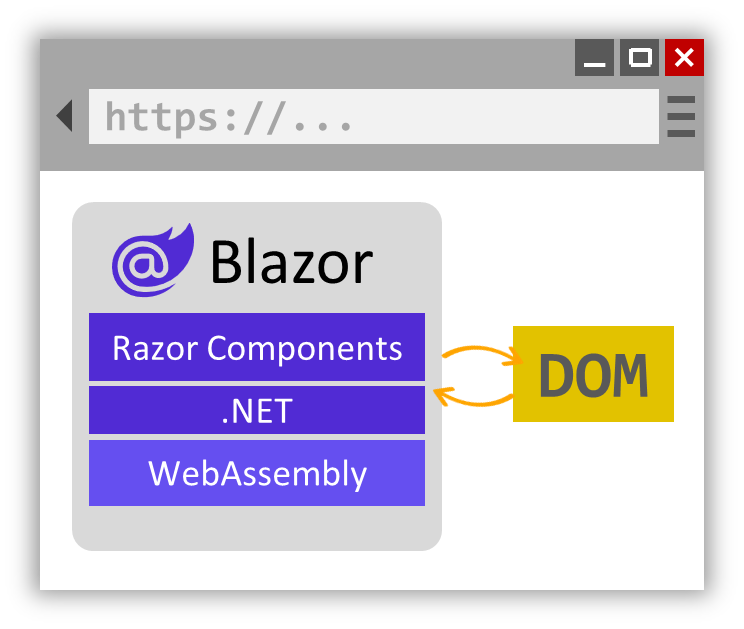

# [overview](https://learn.microsoft.com/en-us/aspnet/core/blazor/fundamentals/?view=aspnetcore-9.0)
To *render* means to produce the HTML markup that browsers display. 
Razor components are either *statically* or *interactively* rendered, and rendered either *client-side* or *server-side*.

## rendering concepts
### server-side static
Server-side rendering allows the web app to access resources on the server, like databases and backend services. By default, components rendered server-side are static. In static rendering:
  - The component is rendered without interaction between the user and .NET/C# code.
  - JavaScript and DOM events process normally, but no user events on the client can be processed.

### server-side interactive 
Components can also be rendered interactively from the server, enabling them to handle UI events, maintain state, and render updates dynamically. In this mode:
- Components can process .NET events via C# code by the ASP.NET Core runtime.
- The architecture looks like this:

### client-side interactive
When components are interactively rendered from the client:
- Components can process .NET events via C# code in the browser (in the Blazor WASM runtime).
- The architecture looks like this:

### pre-rendering
The process of initially rendering page content on the server without event handlers for rendered controls.
See [here](../components/render-modes.md#pre-rendering) for more information.

## more information
See [render modes](../components/render-modes.md).