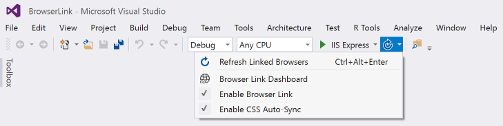

# [Overview](https://learn.microsoft.com/en-us/aspnet/core/client-side/using-browserlink?view=aspnetcore-7.0)  

Browser Link is a Visual Studio feature that creates a communication channel (SignalR) between Visual Studio and one or more browsers.

Uses:
* Refreshing web app in several browsers at once
* Testing across multiple browsers
* Selecting UI elements and seeing what markup/source code they correlate to in Visual Studio

# configuring
1. Add the package:
    ```powershell
    dotnet add package Microsoft.VisualStudio.Web.BrowserLink
    ```
2. Configure the app:
    ```cs
    using Microsoft.VisualStudio.Web.BrowserLink;
    // ...
    if (env.IsDevelopment()) 
    {
        app.UseDeveloperExceptionPage();
        app.UseBrowserLink();
    }
    ```

# using
With an ASP.NET Core project open in Visual Studio, on the Debug toolbar, the Browser Link toolbar control is added:  



From this control, open **Browser Link Dashboard** and check **Enable Browser Link**.

Optionally, check **Enable CSS Auto-Sync** to automatically refresh browsers when a CSS file is changed.