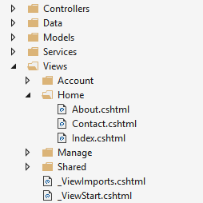

From Pluralsight/ASP.NET Core 6 Fundamentals

# Overview
A view is an HTML template as a `.cshtml` file with embedded Razor markup (code that interactions w/HTML to render a page).
- Views handle data presentation and user interaction.
- Views are organized like this where each folder on `Views/` is named for each of the app's controllers:
-    
	
    - In `Views/Home`, when a user requests either `Index`, `Contact`, or `About`, the `Home` controller determines which of the views is used to build and return that page to the user.

# Layouts
Layouts provide consistent web page sections (like header, footer, navigation/menu).

# View Responsibilities
Present content through the UI so it can be processed by a controller action.  
Contains minimal logic, and the logic they do contain is related to presenting content.
- Conditions, loops
- Tag helpers, view components
	
The view is a template (cshtml) that contains markup to visualize the data of the model.  
Server-side code will generate HTML which will be sent to the client.

For every controller, a corresponding subfolder of that controller's name is created under `/Views`.  
- For example, if `/Controllers/PieControllers.cs`, then `/Views/Pie/` and for each action, an `action-name.cshtml` file.

A basic View:
```html
<!DOCTYPE html>

<html>
    <head>
        <title>Index</title>
    </head>
    <body>
        <div>
            @ViewBag.Message
        </div>
    </body>
</html>
```

A strongly-typed View involves passing a model to the View and the View accesses the model's properties:
```html
@model IEnumerable<Pie> // include the type of object being passed in
<html>
    <body>
    <div>
        @foreach (var pie in Model) // the model is accessed via Model
        {
        <div>
        <h2>@pie.Name</h2>
        <h3>@pie.Price.ToString("c")</h3>
        <h4>@pie>Category.CategoryName</h4>
        </div>
        }
    </div>
    </body>
</html>
```

# ViewModel Responsibilities
When a Model we want to pass to a View does not map to a domain model, use a `ViewModel`.  
A `ViewModel` is a class that wraps multiple properties so that the View can access the data it needs.  It is a model for the view.
`ViewModel`s are not entities that live in the database.  They are stored under `/ViewModels` by convention.
```cs
public class PieListViewModel
{
	public IEnumerable<Pie>? Pies { get; set; }
	public string? CurrentCategory { get; set; }
}
```

# Creating a View
Views that are specific to a controller are placed in `Views/ControllerName`.  Views that are shared are placed in `Views/Shared`.

This is `Views/Home/About.cshtml`:
```cs
@{
    ViewData["Title"] = "About";
}
```
```html
<h2>@ViewData["Title"].</h2>
<h3>@ViewData["Message"]</h3>

<p>Use this area to provide additional information.</p>
```

# Returning Views in Controllers
Views are returned from controller actions as a `ViewResult`, a type of `ActionResult`, using the `View` helper method:

`HomeController.cs`
```cs
public IActionResult About()
{
    ViewData["Message"] = "Your application description page.";

    return View(); // return a view with the same name as the action method from which it's called
}
```
The View helper method has some overloads:
- `return View();` // return a view with the same name as the action method from which it's called
- `return View("Orders");` // return an explicit view
- `return View("Views/Home/About.cshtml");` // return an explicit view; the extension is required if using an absolute path
- `return View("../Manage/Index");` // return an explicit view inside a relative path 
- `return View(Orders);` // pass a model to the view
- `return View("Orders", Orders);` // both a view and a model

## View Discovery
When a controller action returns a view, view discovery occurs to determine which view file is used.  This varies based on the `View` method overload used.  View discovery searches `Views/ControllerName` then `Views/Shared`.
