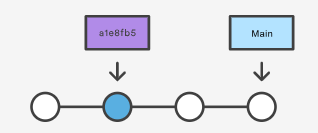
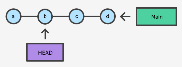
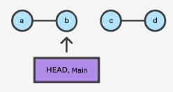
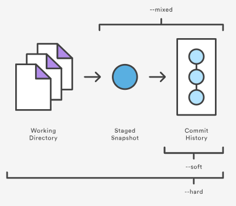

# exploring previous commits
## review commit history
- `git log -n --oneline` — review the previous `n` commits
- `git log --branches=*` — view all commits across all branches
- `git branch -a` — return a list of all known branches

## access a previous commit
Use `git checkout COMMIT-ID` to load a previous commit.  

Normally, `HEAD` points to `main` or some other local branch.  When checking out a previous commit, `HEAD` no longer points to a branch; it is `detached`.  It points to that commit instead.  


Use `git checkout BRANCH-NAME` to get back to the branch you were working on.

# modifying the most recent commit
To modify the most recent commit only:
1. Make the changes you want to make
2. Use `git add` to stage the changes
3. Use `git comimt --amend` to apply those changes to the most recent commit

# undoing commits
For all examples, consider this commit history resulting from calling `git log --oneline` as the starting point:

```
872fa7e Try something crazy
a1e8fb5 Make some important changes to hello.txt
435b61d Create hello.txt
9773e52 Initial import
```

## with revert
Use `git revert` when dealing with a shared (remote) repo:
- It works on a single commit.
- It takes a specified commit, reverses the changes made in that commit, and creates a new commit for those reversed changes.
- It preserves the repo's commit history.

### reverting the most recent commit
Use `git revert HEAD`.  The commit history now looks like this:

```
e2f9a78 Revert "Try something crazy"
872fa7e Try something crazy
a1e8fb5 Make some important changes to hello.txt
435b61d Create hello.txt
9773e52 Initial import
```

Although `872fa7e` still exists in the history, `e2f9a78` is a new commit that undoes changes the changes of `872fa7e`.

### reverting an earlier commit
Use `git revert COMMIT-ID`.

## with reset
Use `git reset` when dealing with changes in a local repo only (changes that are committed but not pushed):
- It destroys all changes in the chain back to the targeted commit.
- It destroys commit history.

Executing `git reset --hard a1e8fb5` results in the commit history now looking like this:

```
a1e8fb5 Make some important changes to hello.txt
435b61d Create hello.txt
9773e52 Initial import
```

Although `e2f9a78` and `872fa7e` no longer exist in the commit history, *they still exist in the remote repo*.  A `git push` will now fail.  Use `git push origin BRANCH-NAME --force` <r>with consequences</r>.

# checkout vs reset
Assume this commit history:  


Executing `git checkout b` results in the `main` ref still pointing to `d` and the `HEAD` ref pointing to `b`: 


Executing `git reset b` results in the `main` AND `HEAD` refs pointing to `b` and no longer has history of `c` and `d`:  


# more on reset
- `git reset` has three different reset modes that work on different combinations of the commit history, the staging index, and the working directory:  

- It uses `--mixed HEAD` as its default option (executing `git reset` is equivalent to executing `git reset --mixed HEAD`)
- Documentation: https://www.atlassian.com/git/tutorials/undoing-changes/git-reset

## soft reset
Using `git reset --soft COMMIT-ID`:
- The commit history ref pointers are updated to that of `COMMIT-ID`
- The staging index and working directory are left untouched

## mixed reset
Using `git reset --mixed COMMIT-ID`:
- The commit history ref pointers are updated to that of `COMMIT-ID`
- The staging index is reset to match that of `COMMIT-ID`
- Any changes that have been undone from the staging index are moved to the working directory

## hard reset
Using `git reset --hard COMMIT-ID`:
- The commit history ref pointers are updated to that of `COMMIT-ID`
- The staging index is reset to match that of `COMMIT-ID`
- The working directory is reset to match that of `COMMIT-ID`
- <r>All pending work is lost</r>

# rebasing
- Rebasing makes for a cleaner history.
- A rebased branch appears as if all the work happened in a series, even when it actually happened in parallel.
- You may rebase when contributing to a project to which you do not maintain.
- Do not rebase commits that exist outside of your repository.
- Do not rebase commits that people may have based work on.
- Do rebase local changes before pushing to clean up your work.
