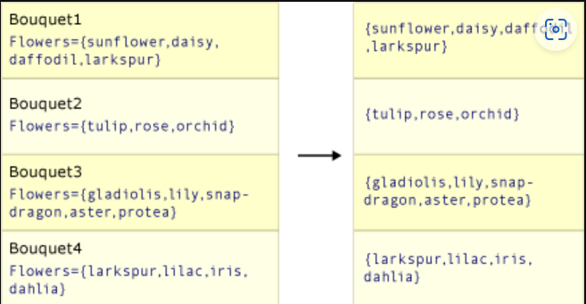
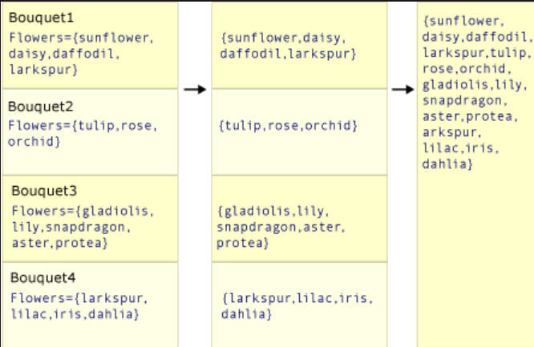

A projection operation transforms an object into a new form that often consists only of those properties that will be subsequently used.

# Methods
| Method     | Description                                                                                                | Query expression      |
| ---------- | ---------------------------------------------------------------------------------------------------------- | --------------------- |
| `Select`     | Project values that are based on a transform function                                                      | select                |
| `SelectMany` | Project sequences of values that are based on a transform function and then flatten them into one sequence | Multiple from clauses |
| `Zip`        | Produce a sequence of tuples with elements from 2-3 sequences                                              | N/A                   |

# Notes
The output sequence of a zip operation is never longer in length than the shortest input sequence. Each element needs a corresponding element in the other sequence to "zip" with.

# Details
## `Select`
`Select` produces one output value for every input value, like so:  


```cs
List<string> words = new() { "an", "apple", "a", "day" };

IEnumerable<string> result = words.Select(selector => selector.ToUpper());

foreach (string r in result)
    Console.WriteLine(r);
```

## `SelectMany`
`SelectMany` produces a single output that contains the concatenated sub-collections from each input value. The transform function that is passed must return an enumerable sequence of values for each source value. These enumerable sequences are then concatenated to create one large sequence, like so:


```cs
List<string> phrases = new() { "an apple a day", "the quick brown fox" };

IEnumerable<string> result = phrases.SelectMany(p => p.Split(' '));
```

## `Select` vs `SelectMany`
```cs
class Bouquet
{
    public List<string> Flowers { get; set; }
}

public static void SelectVsSelectMany()
{
List<Bouquet> bouquets = new()
{
    new Bouquet { Flowers = new List<string> { "sunflower", "daisy", "daffodil", "larkspur" }},
    new Bouquet { Flowers = new List<string> { "tulip", "rose", "orchid" }},
    new Bouquet { Flowers = new List<string> { "gladiolis", "lily", "snapdragon", "aster", "protea" }},
    new Bouquet { Flowers = new List<string> { "larkspur", "lilac", "iris", "dahlia" }}
};

IEnumerable<List<string>> query1 = bouquets.Select(bq => bq.Flowers);

IEnumerable<string> query2 = bouquets.SelectMany(bq => bq.Flowers);

Console.WriteLine("Select:");
foreach (IEnumerable<String> collection in query1)
    foreach (string item in collection)
        Console.WriteLine(item);

Console.WriteLine("SelectMany");
    foreach (string item in query2)
        Console.WriteLine(item);
}
```
