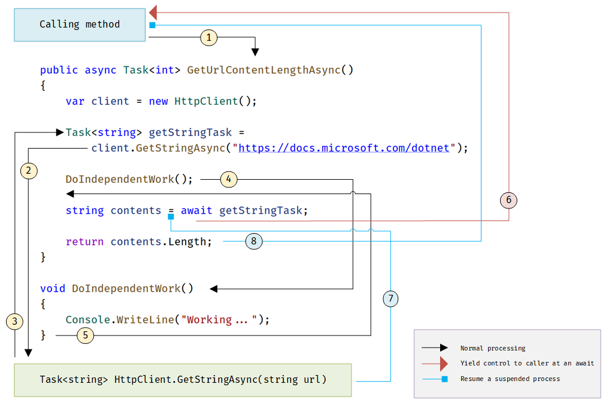

# Await
The `await` keyword marks a point where the method cannot continue until the awaited async operation is complete.
- It suspends this method and yields control back to the caller until then.
- It signs up the rest of the method as a continuation.
- It does not run on its own thread (unless called via `Task.Run()`).

Example
```cs
async Task<int> GetTaskOfResultAsync() {
	int hours = 0;
	await Task.Delay(0);
	return hours;
}

// This calls the async method:
Task<int> returnedTaskTResult = GetTaskOfResultAsync();
// This awaits the Task that the method returns and "unwraps" the int it holds:
int intResult = await returnedTaskTResult;
```

# Awaiting `Task.Run` or `Task`/`Task<T>`
- For I/O-bound code, await an operation that returns a `Task` or `Task<T>` inside an async method.
- For CPU-bound code, await an operation that is started on a background thread with `Task.Run`.
	- Or, consider the Task Parallel Library.

# Await Decision Table
The Task.Wait* methods are synchronous, not asynchronous.

| Goal | Use this | Not this |
|------|----------|----------|
Retrieve the result of a background Task | `await` | `Task.Wait` or `Task.Result`
Waiting for any task to complete | `await Task.WhenAny` | `Task.WaitAny`
Waiting for all tasks to complete | `await Task.WhenAll` | `Task.WaitAll`
Waiting for a period of time | `await Task.Delay` | `Thread.Sleep`

Example  


1. `someOtherMethod()` calls and awaits `GetUrlContentLengthAsync()`.
2. `GetUrlContentLengthAsync()` creates an HTTP client and calls `GetStringAsync()`.
3. `GetStringAsync()` is blocking (waiting for a website to download).  
   - Since it's an async method, it is suspended.  It returns a `Task<string>` to `GetUrlContentLengthAsync()`.
   - The Task is a promise to produce a string when complete.  Meanwhile, it yields control to `GetUrlContentLengthAsync()`.
4. Since `getStringTask` has not yet been awaited, `GetUrlContentLengthAsync()` continues with `DoIndependentWork()`.
   - Note:  If there was no independent work to do, this could be simplified like this:
    ```cs
    string contents = await client.GetStringAsync("…");
    ```
5. `DoIndependentWork()` does its work and returns to `GetUrlContentLengthAsync()`.
6. `GetUrlContentLengthAsync()` has no more work to do without a result from `getStringTask`.  
   - `getStringTask` is now awaited.  Control is yielded to `someOtherMethod()`.
   - `GetUrlContentLengthAsync()` returns a `Task<int>` to `someOtherMethod()`.
     - The task is a promise to produce an int when it is complete.
7. `GetStringAsync()` finishes and produces a string result.  This result is stored in the `Task<string>` it returned in (3).
   - The await retrieves the result from `getStringTask`, which is then assigned to contents.
8. `GetUrlContentLengthAsync()` receives its string result.

# Async Code & LINQ
Use caution.  LINQ uses deferred (lazy) execution, so async calls won't happen immediately (unless iteration is forced via `.ToList()` or `.ToArray()`)


