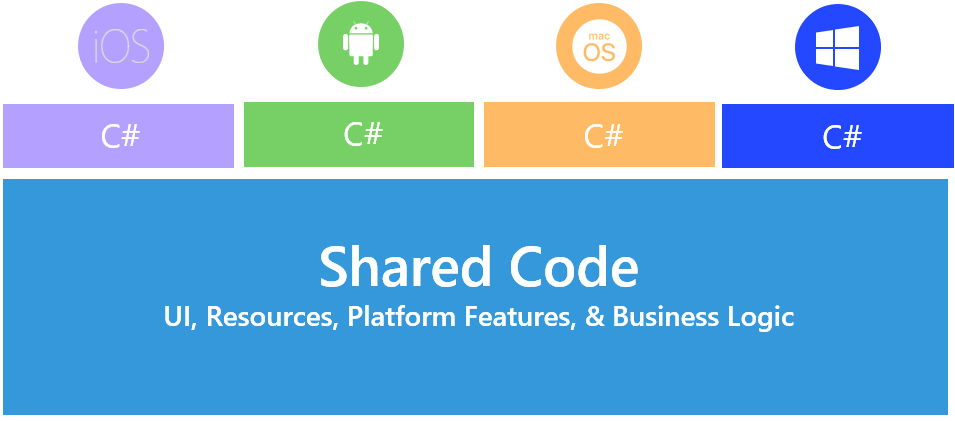
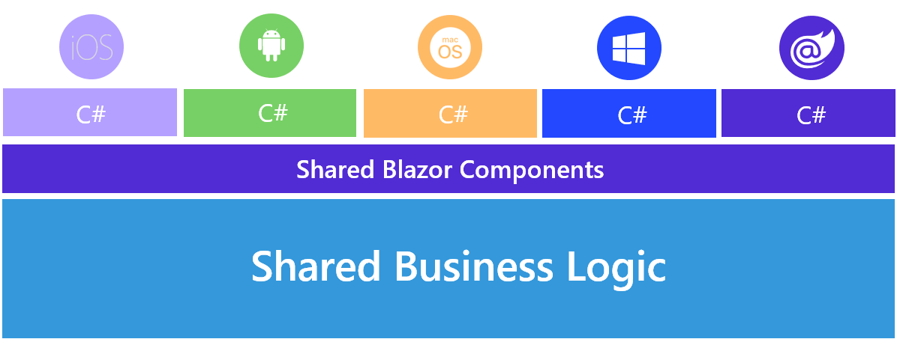

# Overview
- Multi-platform Application User Interface.
- Generates native code for the target device.
- MAUI leverages WinUI 3 (via Windows App SDK) for Windows apps.
- Documentation: https://learn.microsoft.com/en-us/dotnet/maui/
- Documentation: https://dotnet.microsoft.com/apps/maui

 
# Cross-Platform
- Each supported platform (iOS, Android, macOS, Windows) has its own set of APIs.
- There are also cross-platform APIs (phone dialer, device info, file system, geolocation, etc) that can be used which covers all platforms.
- .NET for iOS — AOT compilation to produce an ARM binary (.app)
- .NET for Android — JIT, AOT, Hybrid options (.apk)
- .NET for macOS — leverages Mac Catalyst
- .NET for Windows — leverages WinUI 3

# Web
Blazor Hybrid (Blazor + .NET MAUI) — Share Razor components with a .NET MAUI App.  

 
# UI
In MAUI, UI's can be created in XAML or C#.

# Handlers
MAUI uses handlers to carry out UI operations:  

