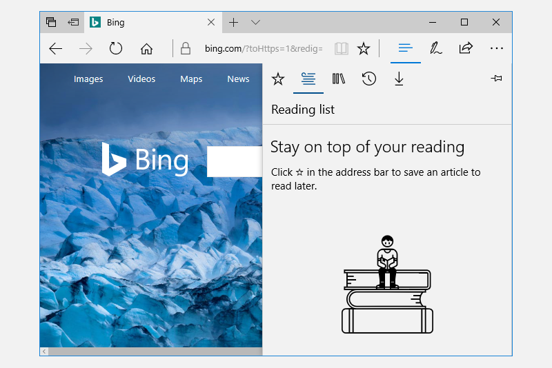

# Overview
[SplitView class (microsoft.com)](https://learn.microsoft.com/en-us/windows/windows-app-sdk/api/winrt/microsoft.UI.Xaml.Controls.SplitView)  
SplitView controls have an expandable / collapsible pane and a content area:  
  

SplitView's content area is always visible.
The pane has four modes:
1.  `Overlay` — hidden until opened; when opened, overlays content area
2.  `Inline` — always visible, does not overlay content area
3.  `CompactOverlay` — narrow portion (just wide enough to show icons) is always visible; when opened, overlays content area
4.  `CompactInline` — same as `CompactOverlay` but, when opened, pushes content out of its way

```xml
<SplitView IsPaneOpen="True"
    DisplayMode="Inline"
    OpenPaneLength="296">
    <SplitView.Pane>
        <TextBlock Text="Pane"
        FontSize="24"
        VerticalAlignment="Center"
        HorizontalAlignment="Center"/>
    </SplitView.Pane>

    <Grid>
        <TextBlock Text="Content"
        FontSize="24"
        VerticalAlignment="Center"
        HorizontalAlignment="Center"/>
    </Grid>
</SplitView>
```
