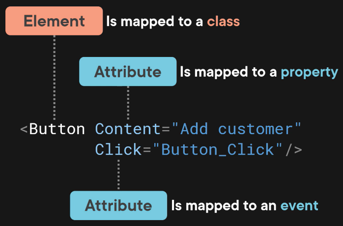
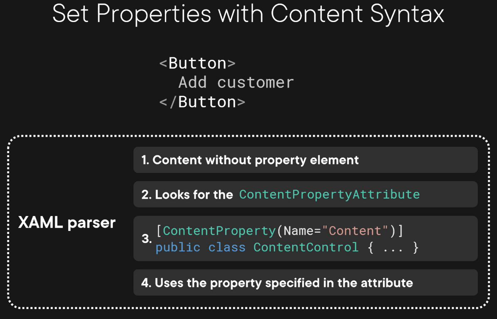
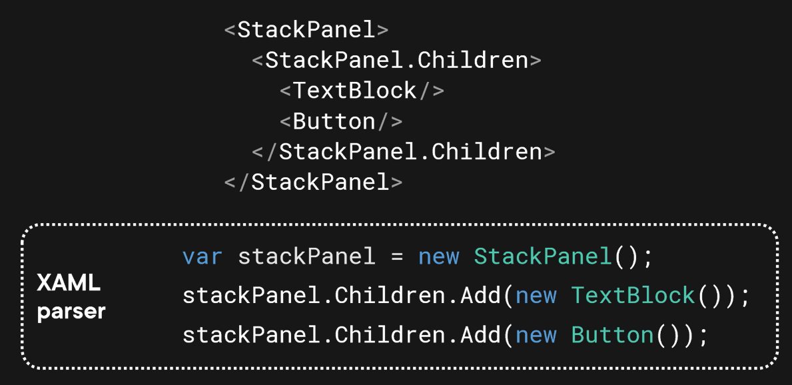

  

# Elements & Attributes
## Attribute Syntax
`Button` is an *element*; in XAML, elements are mapped to Classes.  
```xml
<Button>
    Content="Add customer"
</Button>
```
^ Closing element tag.

Since the element has no content between the opening/closing tags, it can instead be written as a self-closing element:
```xml
<Button
    x:Name="btnAddCustomer" This is a a special XAML attribute.
    Content="Add customer" `Content` is an *attribute*; in XAML, attributes can map to *properties*.
    Clicked="Button_Click" /> 
```
This attribute is mapped to an *event* of the button, `Button_Click`.

If this were C#, the corresponding code would be:
```cs
var btnAddCustomer = new Button 
{
    Content = "Add customer"
};

btnAddCustomer.Click += Button_Click;
```

## Property-element Syntax
Use when you need to assign a complex object to a property.

This `Button` element maps to the `Button` class; it *creates an object of type `Button`*; it is known as an *object element*.
```xml
<!--  
This element is in *Class.Property* form; it maps to the `Content` property of the `Button` class; it is known as a *property element*. -->
<Button x:Name="btnAddCustomer">
    <!-- Using *property element syntax*, we can assign a complex object to this property. -->
    <Button.Content> 
    <!-- "Horizontal" means align the SymbolIcon and the TextBlock horizontally. -->
        <StackPanel Orientation="Horizontal"> 
            <SymbolIcon Symbol="AddFriend"/>
            <!-- The Margin property uses format left right top bottom: -->
            <TextBlock Text="Add customer" Margin="5 0 0 0"/>
        </StackPanel>
    </Button.Content>
</Button>
```

The resulting Button:  
  

## Content Syntax
Use to set content directly in an object element.

How it works:  
    

Content syntax is always used when you put content in an object element without the property element.

## Collection Syntax
Instead of assigning a value to a property, the XAML parser calls the Add method on the collection to add every element to the collection:  
  

`ContentControl` is a base class of `Button`.
