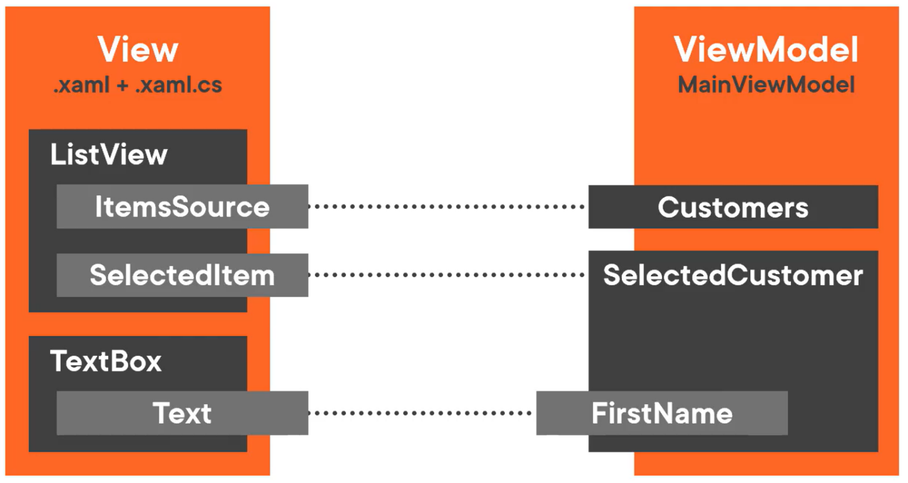

# Add a SelectedCustomer Property
  

This is the current state. The `Text` property of the `TextBox` is bound to the `SelectedItem` property of the `ListView` so that the `FirstName` of the selected customer displays in the `TextBox`.  

However, the binding was achieved through UI logic in XAML. The `ViewModel` has no idea what `Customer` is selected.  

To solve for this, created a `SelectedCustomer` property in the ViewModel and bind it to the `SelectedItem` in the `ListView`. The `SelectedCustomer` has a `FirstName` property; bind it to the `Text` in the `TextBox`. This effectively moves the selection logic to the ViewModel:  
  

`MainViewModel.cs`
```cs
public class MainViewModel
{
    private readonly ICustomerDataProvider _customerDataProvider;

    // Using an interface prevents MainViewModel from being tightly coupled to DataProvider
    public MainViewModel(ICustomerDataProvider customerDataProvider) { … }

    // A collection type that notifies the data binding when items are added or removed
    public ObservableCollection<Customer> Customers { get; } = new();

    public Customer? SelectedCustomer { get; set; }

    public Task LoadAsync() { … }
}
```

`MainWindow.xaml`
```xml
<ListView Grid.Row="1" x:Name="customerListView"
    ItemsSource="{Binding Customers, Mode=OneWay}"
    Bind the SelectedItem property to the SelectedCustomer property in the DataContext:
    `SelectedItem="{Binding SelectedCustomer, Mode=TwoWay}"`
    DisplayMemberPath="FirstName"
    ScrollViewer.HorizontalScrollMode="Enabled"
    ScrollViewer.HorizontalScrollBarVisibility="Auto"/>

    <!-- Customer detail --->
    <StackPanel Grid.Row="1" Grid.Column="1" Margin="10">
        The Text property is bound to the FirstName property of the SelectedCustomer:
        <TextBox Header="Firstname" Text="`{Binding SelectedCustomer.FirstName, Mode=TwoWay}`"/>
        <TextBox Header="Lastname" Margin="0 10 0 0"/>
        <CheckBox Margin="0 20 0 0">
            Is developer
        </CheckBox>
    </StackPanel>
```
