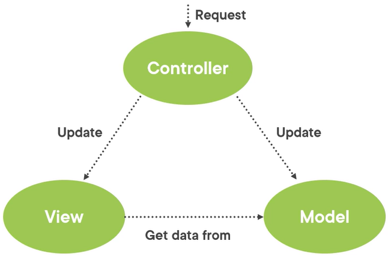

From Pluralsight/ASP.NET Core 6 Fundamentals

# Overview
Project type = ASP.NET Core Web App (`dotnet new mvc`)  


# MVC Pattern
Requests are routed to a *controller*.  Controllers have *actions*—public methods associated with a URL.  
The controller works with the *model* to perform actions and/or retrieve data.  
The controller chooses the *view* to display to the user and provides that view with any model data it requires.

Both the view and the controller depend on the model.  The model depends on neither.

## Controller Responsibilities
The glue between the model and the view.  Includes the logic that works on the model.  
Components that handle user interaction, work with the model, and select a view to render.  

The view only displays information; the controller handles and responds to user input.  It controls how the app responds to a given request by selecting which model types to work with and which view to render.
```cs
public class PieController : Controller
{
	private readonly IPieRepository _pieRepository;
	
	public PieController(IPieRepository pieRepository) => _pieRepository = pieRepository;
	
	public ViewResult List() // an "action"; returns a ViewResult so a user sees a web page as a result of sending a request
	{
		// the ViewData.Model property of the ViewResult will be set to _pieRepository.Pies:
		return View(_pieRepository.Pies);
	}
}
```
# ASP.NET Core MVC Overview
- Uses ASP.NET's routing.
- Uses model binding to convert client request data (like form values, route data, query string parameters, HTTP headers) into objects that the controller an handle.
- Supports validation through decorating model objects with data annotation validation attributes.
- Supports dependency injection in both controllers and views.
- Supports filters to run custom pre- and post-processing logic for action methods.
- Supports areas to partition a large web app into smaller functional groups.
- Supports building web APIs.
- Testability.
- Supports the Razor view engine.

# Routing
## Convention-based Routing
Define URL formats that the app accepts and map those formats to an action method on a given controller:
```cs
routes.MapRoute(name: "Default", template: "{controller=Home}/{action=Index}/{id?}");
```

## Attribute Routing
Specify routing information by decorating controllers and actions with attributes that define routes:
```cs
[Route("api/[controller]")]
public class ProductsController : Controller
{
    [HttpGet("{id}")]
    public IActionResult GetProduct(int id)
    {
      ...
    }
}
```

# Dependency Injection in Razor View Files
Use the `@inject` directive:
```html
@inject SomeService ServiceName

<!DOCTYPE html>
<html lang="en">
<head>
    <title>@ServiceName.GetTitle</title>
</head>
<body>
    <h1>@ServiceName.GetTitle</h1>
</body>
</html>
```

# Filters
Filters enable running custom pre- and post-processing logic for action methods.  They can be configured to run at certain points in the execution pipeline for a given request.
