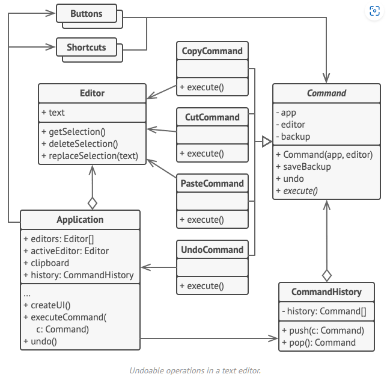
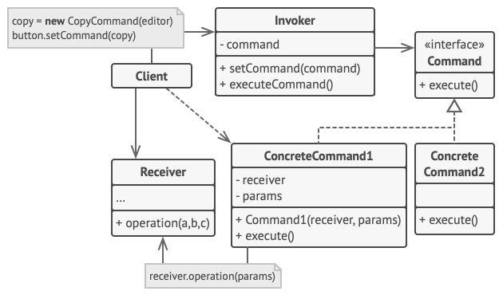

  

# Command
Type:  Behavioral  
Purpose: Turns a request into a stand-alone object that contains all information about the request.  
Use to:
- Enable passing requests as method arguments
- Delay or queue a request's execution
- Implement reversible operations  
- 
Principles: Single Responsibility Principle; Open/Closed Principle  
Complexity:  
Popularity:  
In .NET:  `EventArgs`  

# Implementing
Declare the command interface with a single execution method.
```cs
public interface ICommand
{
    void Execute();
}
```

Extract requests into concrete command classes that implement this interface.  
Each class must have a set of fields for storing the request arguments and a reference to the actual receiver object.  
All these values must be initialized via the command's constructor.  
```cs
class SimpleCommand : ICommand
{
    private string _payload = string.Empty;

    public SimpleCommand(string payload)
    {
        this._payload = payload;
    }

    public void Execute
    {
        // …
    }
}
```

Some commands delegate complex operations to other objects (*receivers*):
```cs
class ComplexCommand : ICommand
{
    private Receiver _receiver;
    private string _a;
    private string _b;

    public ComplexCommand(Receiver receiver, string a, string b)
    {
        _receiver = receiver;
        _a = a;
        _b = b;
    }

    public void Execute()
    {
        // …
        _receiver.DoSomething(_a);
        _receiver.DoSomethingElse(_b);
    }
}
```

Receiver classes contain business logic and know how to perform various operations associated with carrying out a request:
```cs
class Receiver
{
    public void DoSomething(string a) { … }
    public void DoSomethingElse(string b) { … }
}
```
Identify classes that will act as *senders* and add fields for storing commands into these classes.  
Senders must communicate with their *commands* only via the command interface.  
```cs
class Sender
{
    private ICommand _onStart;
    private ICommand _onFinish;

    public void SetOnStart(ICommand command) => _onStart = command;

    public void SetOnFinish(ICommand command) => _onFinish = command;

    public void DoSomething()
    {
        if (_onStart is ICommand)
            _onStart.Execute();

        if (_onFinish is ICommand)
            _onFinish.Execute();
    }
}
```

Senders receive command objects from client code.
```cs
public static void Main()
{
    var sender = new Sender();
    sender.SetOnStart(new SimpleCommand("Say Hi"));

    var receiver = new Receiver();
    sender.SetOnFinish(new ComplexCommand(receiver, "Send email", "Save report"));

    sender.DoSomethingImportant();
}
```

# Visual
  

1. The Sender class (aka invoker) is responsible for initiating requests. This class must have a field for storing a reference to a command object. The sender triggers that command instead of sending the request directly to the receiver. Note that the sender isn’t responsible for creating the command object. Usually, it gets a pre-created command from the client via the constructor.
2. The Command interface usually declares just a single method for executing the command.  
3. Concrete Commands implement various kinds of requests. A concrete command isn’t supposed to perform the work on its own, but rather to pass the call to one of the business logic objects. However, for the sake of simplifying the code, these classes can be merged.  Parameters required to execute a method on a receiving object can be declared as fields in the concrete command. You can make command objects immutable by only allowing the initialization of these fields via the constructor.  
4. The Receiver class contains some business logic. Almost any object may act as a receiver. Most commands only handle the details of how a request is passed to the receiver, while the receiver itself does the actual work.  
5. The Client creates and configures concrete command objects. The client must pass all of the request parameters, including a receiver instance, into the command’s constructor. After that, the resulting command may be associated with one or multiple senders.  

