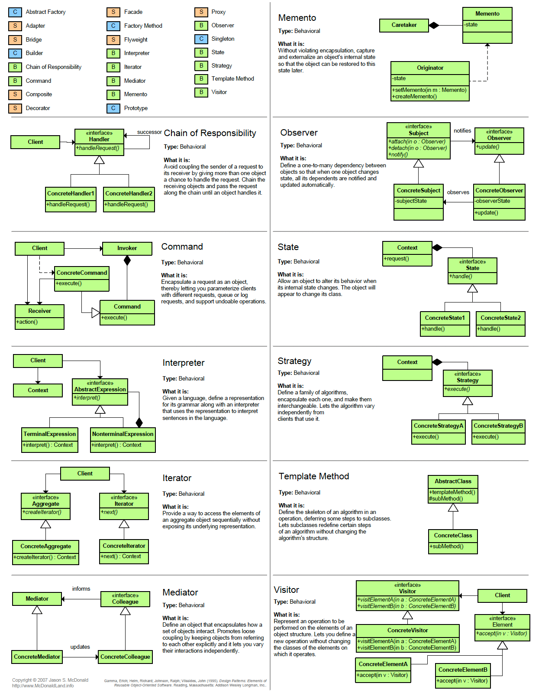

# The 23 Design Patterns from the Gang of Four
<table>
<colgroup>
<col style="width: 14%" />
<col style="width: 26%" />
<col style="width: 26%" />
<col style="width: 33%" />
</colgroup>
<thead>
<tr class="header">
<th><strong></strong></th>
<th><strong>Creational</strong></th>
<th><strong>Structural</strong></th>
<th><strong>Behavioral</strong></th>
</tr>
</thead>
<tbody>
<tr class="odd">
<td><strong>Class</strong></td>
<td>Factory Method</td>
<td>Adapter (class)</td>
<td>
Interpreter

Template Method
</td>
</tr>
<tr class="even">
<td><strong>Object</strong></td>
<td>
Abstract Factory

Builder

Prototype

Singleton
</td>
<td>
Adapter (object)

Bridge

Composite

Decorator

Facade

Flyweight

Proxy
</td>
<td>
Chain of Responsibility

Command

Iterator

Mediator

Memento

Observer

State

Strategy

Visitor
</td>
</tr>
</tbody>
</table>

# Concepts
Factory—a method or class that produces something:
- A method that creates a GUI
- A class that creates users
- A static method that calls a class constructor in a certain way

Creation Method—a method that creates objects.
- Every *factory method* is a *creation method*, but not every *creation method* is a *factory method*.
- It is a wrapper around a constructor call. This can prevent the constructor from needing to be changed.  

Static Creation Method—a *creation method* declared static. 

Simple Factory Pattern—a class that has one creation method with a large conditional that, based on method parameters, chooses which product class to instantiate and then return.  

Factory Method Pattern—a creational design pattern that provides an interface for creating objects but allows subclasses to alter the type of an object that will be created.  

Abstract Factory Pattern—a creational design pattern that allows producing families of related (or dependent) objects without specifying their concrete classes.  
