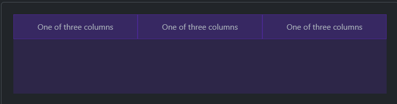
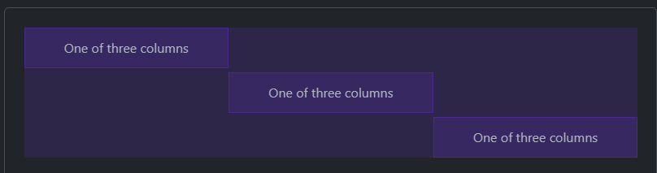
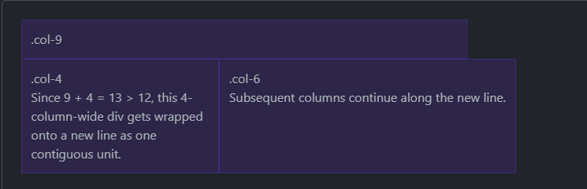
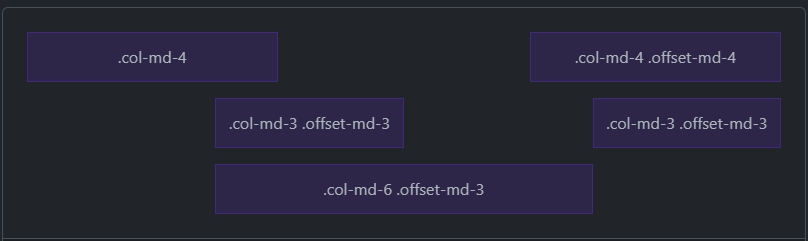
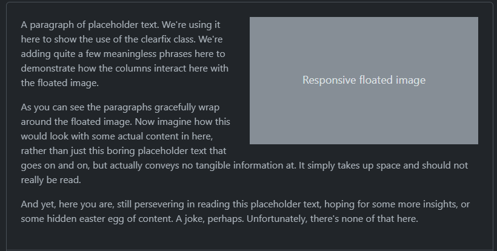

# Overview
How to modify columns with options for alignment, ordering, and offsetting.  Using column classes to manage widths of non-grid elements.
- When building grid layouts, all content goes into columns.
- Bootstrap has predefined classes for creating layouts.

# Alignment
## Vertical Alignment
Change the `align-items-*` classes:
```html
<div class="container text-center">
  <!-- also, align-items-center and align-items-end: -->
  <div class="row align-items-start">
    <div class="col">
      One of three columns
    </div>
    <div class="col">
      One of three columns
    </div>
    <div class="col">
      One of three columns
    </div>
  </div>
</div>
```  


Change the alignment on individual columns with `align-self-*`:
```html
<div class="container text-center">
  <div class="row">
    <div class="col align-self-start">
      One of three columns
    </div>
    <div class="col align-self-center">
      One of three columns
    </div>
    <div class="col align-self-end">
      One of three columns
    </div>
  </div>
</div>
```  


## Horizontal Alignment
Use the `justify-content-*` classes:
```html
<div class="container text-center">
  <div class="row justify-content-start">
    <div class="col-4">
      One of two columns
    </div>
    <div class="col-4">
      One of two columns
    </div>
  </div>
  <div class="row justify-content-center">
    <div class="col-4">
      One of two columns
    </div>
    <div class="col-4">
      One of two columns
    </div>
  </div>
  <div class="row justify-content-end">
    <div class="col-4">
      One of two columns
    </div>
    <div class="col-4">
      One of two columns
    </div>
  </div>
  <div class="row justify-content-around">
    <div class="col-4">
      One of two columns
    </div>
    <div class="col-4">
      One of two columns
    </div>
  </div>
  <div class="row justify-content-between">
    <div class="col-4">
      One of two columns
    </div>
    <div class="col-4">
      One of two columns
    </div>
  </div>
  <div class="row justify-content-evenly">
    <div class="col-4">
      One of two columns
    </div>
    <div class="col-4">
      One of two columns
    </div>
  </div>
</div>
```  


## Column Wrapping
After 12 columns on a single row, each group of extra columns will, as one unit, wrap onto a new line:
```html
<div class="container">
  <div class="row">
    <div class="col-9">.col-9</div>
    <div class="col-4">.col-4<br>Since 9 + 4 = 13 &gt; 12, this 4-column-wide div gets wrapped onto a new line as one contiguous unit.</div>
    <div class="col-6">.col-6<br>Subsequent columns continue along the new line.</div>
  </div>
</div>
```  



## Column Breaks
Break columns onto a new line by adding an element with `width: 100%` wherever you want to break:
```html
<div class="container text-center">
  <div class="row">
    <div class="col-6 col-sm-3">.col-6 .col-sm-3</div>
    <div class="col-6 col-sm-3">.col-6 .col-sm-3</div>

    <!-- Force next columns to break to new line -->
    <div class="w-100"></div>

    <div class="col-6 col-sm-3">.col-6 .col-sm-3</div>
    <div class="col-6 col-sm-3">.col-6 .col-sm-3</div>
  </div>
</div>
```


# Reordering
Use `order-` classes to control the visual order of content:
```html
<div class="container text-center">
  <div class="row">
    <div class="col">
      First in DOM, no order applied
    </div>
    <!-- order-1 through order-5 are supported: -->
    <div class="col order-5">
      Second in DOM, with a larger order
    </div>
    <!-- also, order-first and order-last are available. -->
    <div class="col order-1">
      Third in DOM, with an order of 1
    </div>
  </div>
</div>
```


# Offsetting Columns
Use `offset-` classes to offset grid columns:
```html
<div class="container text-center">
  <div class="row">
    <div class="col-md-4">.col-md-4</div>
    <div class="col-md-4 offset-md-4">.col-md-4 .offset-md-4</div>
  </div>
  <div class="row">
    <div class="col-md-3 offset-md-3">.col-md-3 .offset-md-3</div>
    <div class="col-md-3 offset-md-3">.col-md-3 .offset-md-3</div>
  </div>
  <div class="row">
    <div class="col-md-6 offset-md-3">.col-md-6 .offset-md-3</div>
  </div>
</div>
```


# Non-column Elements
The `col-*` classes can be used for non-column elements (outside of a `.row`):
```html
<div class="col-3 p-3 mb-2">
  .col-3: width of 25%
</div>

<div class="col-sm-9 p-3">
  .col-sm-9: width of 75% above sm breakpoint
</div>
```



Also, to create responsive floated images, wrap the content in a .clearfix wrapper to clear the float if the text is shorter:
```html
<div class="clearfix">
  

  <p>
    A paragraph of placeholder text. We're using it here to show the use of the clearfix class. We're adding quite a few meaningless phrases here to demonstrate how the columns interact here with the floated image.
  </p>

  <p>
    As you can see the paragraphs gracefully wrap around the floated image. Now imagine how this would look with some actual content in here, rather than just this boring placeholder text that goes on and on, but actually conveys no tangible information at. It simply takes up space and should not really be read.
  </p>

  <p>
    And yet, here you are, still persevering in reading this placeholder text, hoping for some more insights, or some hidden easter egg of content. A joke, perhaps. Unfortunately, there's none of that here.
  </p>
</div>
```


